# Auto-Sample-Trimmer

kan vi anvender den viden vi gennem [[@wakefield_generating_2022_Chapter2_ Modular (Arithmetic of) Time]] har opnået til at skabe en patch hvor stilheden først i et sample kan slettes således at starten af samplet i en buffer er lignet op med den første transient?
## Understanding what we need

- 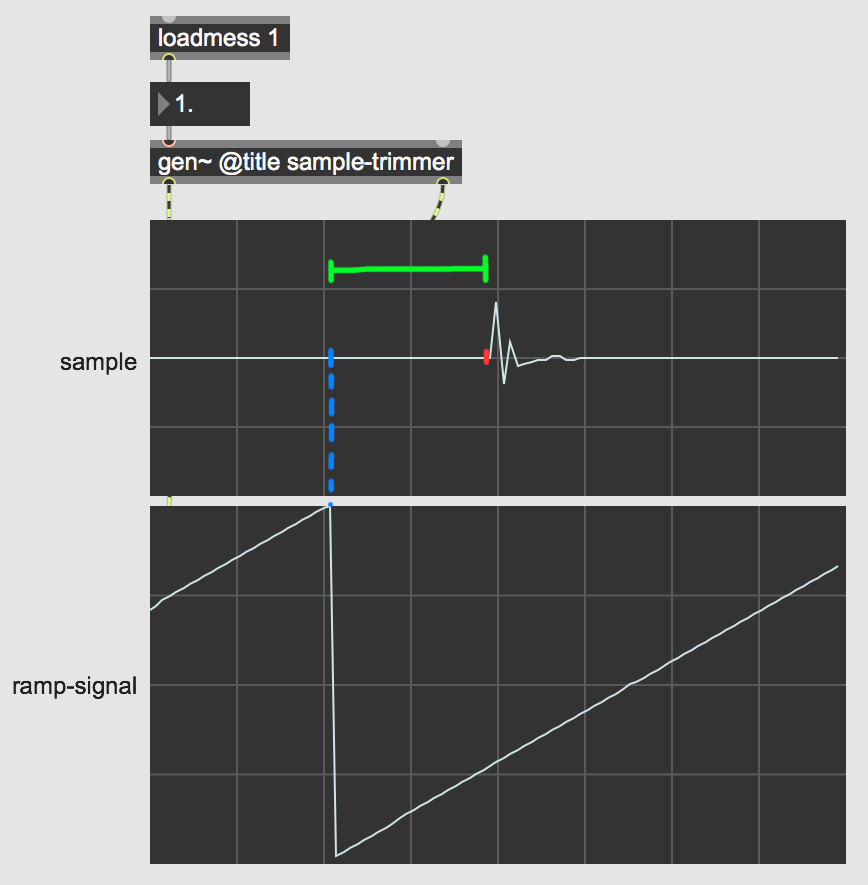

<pre><code>
----------begin_max5_patcher----------
1986.3oc0assbihCD8YmuBJdcyjEItuOs62wTS4RFjs0LXDEHbRlo17suBIA
FL2IXOdqTkIHIn6yoa0poE7qm1nui9FNSW6uz9p1lM+5oMaDMUzvF04azOgd
KHBkIFld.8zIbLS+YYeL7aLQ6YnSIQ3ujwPoLVJ4zIR7guvvYrWdEctbzIHV
vQdGaSwALoTAVNuX+rliA3Eim0.N9EGfFuXn8M0EEmyuWQXlP9.UijPgTo69
9Wf15WFIMmUNTihF+2mdp3mm+jnKkitujQNDihF.KNlBPXBEfvELenXd6ghz
PMNJ.dNEGrbmOJ.qGJhwuxuks.QDEEdBmkoAF.HVd1BcWZMLD+ObF3.32MNJ
GprI16IXo7z0091BfXV.MA+wDvgqkvtXZTcnBJAnnf.Zdr3JrML5BgvNPnWO
VJUqon3CJvIEZMQtKeeF4mhdAFKwztOhxk5331AV7qca62dZ5IjXrNS0hZeQ
b7ozXFNcKNFsKBWG0M4BXuV6m0z2wInaqUGnlMthVc+gM5eZCaOyYOfi+P6u
YDt.0TqVHVn.mNNK3KIAamgmD2AX6wCuWqZYP9p+qRRBsiqrRfqPN2KjDgOi
SyHz3ZdcazQII0ZdSsKoft9NUbi7dtpIRrrI6plRwmIWea422TNGw3DTdpPm
0eywR+xsgFhSiyIhqQ1H2voTIgIJl62mkfBjWbXVxKbCS4MP+ByaKBaBLLEy
AMDteV10b+3tAGhnA+.GVy6gynI3XRbRJNiu5Choz+ptCw6Q4Qrs6owrJ2rh
Y3cz+dkV1YmE3P.g+IkTsp7F8CojPZbgRzvZTzbo33IcHmZYWGLhQDiR53h4
9QbZomN4Y7vxy1gRKLVpHIvxNYTZTytpttH7dlp6DRb7UrHilzemojCGG3Z2
Q4cdZn6snmrs4wxd2x8KXayPmax1LTTjZtbya+anXBOxKlQjl.nQUmxnoGyB
RoQQMvqrmyczSH2OO.+JIjcTHn5NC7gSRJchzqrxgjC7TKa1FCcHqYKYr2kj
dslx2olGukg4wf3nn4.3yPHYrrizWyTCrzQqNAbIm45yqqGXrQ6CEfrYPRd7
HMX8d5HlnoumXxnXZilo80wD6covVKG1PRcjr1lxf+p3HqOdeMEknYTkFWuO
kfoLMTeQJP1eBHC5Gx0uj9xs61yHYuR3vWyXhLhkXIQa33LBrGFw3QmQNxmP
RSeeDBAxyv2tZAKKqE6h3+nyG+wXtFtpbEkqxA7K3kE4a38nSE+oJSxzh33S
hUT+t7HHtO7APDLh1o24IxuchAVMcDG7cWbXDm9oE3fzxy2QpgyH6woSjZrL
kAUEAX87FmYL5lYr++.yPh0.ZG+4Dir.lZH1dnjG9Eg4zATq3QXXiwHFxhx3
J7OrWtWB7QmRJxLchQS97YlZMuDSu7TbQj39xMWnuE82MOjQySCJY0xTE0Zp
57mGgQhqdn1udIM5qFHMMTVofokF8bUMmIpYVxwcSzgISON8yNveuZleqwch
DlPIwrrFaNgITtHIzRdn9Y9x5R5YTdR2HEbaPpwTcQA2POA3TUBianR3MGk.
biTB+IpDd2PcvcF5vMK1vD0A2d0AUixVlY8mK1XHzAbqBPGDgQCUqY.v8x9E
0dwqQK0rq4cY+h5o75Io3DbbnFOmE9vGBl9RnI2YOe6YuuXtf6CNyOsav8Fn
DHxp4ZO+M3y03gY6f5ym8.lI2gm9oAnmHaKfOr6ZiMpea09GbasmmxiXjrHR
3EiJMkzwlDLjs10UV4dQQdLslgw1Atbic.MlEhXngYkmWJy7J5LtXyL+X7fS
1x8ADJ2ILmdI.61DfYOumDNW12u8Wp1sdyGRtMb2GQQrBLOv+DQxXKmVFIPW
JFENDg4odJUAu4sfs+282Y3bo03iqpUwP.00egwyANybORqruKOdWOnNONAE
7CsL9e601ODncjf1PLOPB84A5dVr1Zvo2s8xuoKsYB7W3Ra.3CyRa6xYLZ7P
KfI2TGY4jp9c5PcAqh26b3U2iNfFEokPidWNgVFQbL2ZSG6tKG63qxsPuZUT
Z0vJ1J3vsxs8dKp384iaDk0Uo9q9.l6E2bqk4wlCpdmEbVdJ78Plob8GqUvg
ZikUjhIAtxx2NBSZ1lI6Y0RyQYx0z6goU79FnEleJQarGeQN0QVnZfw7WFvZ
l.V7lPvAbgxUbTpeKB8Qjy3WBSoIkpvYzkDQZ0YHNfFhKdSWpijA7AjThkg7
MYYFTh4PQV.yOH50yvplZMvjrynnbLce6WhnK5DItiWvj5CHhFenW9rwHyNR
SYSankXy5o5O79ZNcuLSOTRwgwmrK888clsqO725CtWs3PQ1dWNaBA2jaAix
ydd4Gnu3T.V5ZDscOD2qlkrWxiWWuIEa1tNSMJ3VeU7y9RUlZYwlpjTUraXA
4sBBpTaGTRdqDhFSN9qfbbfSwFAWAIUT+swkzZHHvDDjyp.IiIHI20.SNVSm
7Ti4pMKA5CjunIpM+Ss8v0OSkMV2mAUMJeMdjOBvmCRSAQlq.2YOgfCtFqjf
F0uaEji0cTNv6jb.2g.CSI.zZDV.dmBzAbmhfVCKjXd3nlH20PRv6jyMXJwt
sVCAMApyYsDzX.pcxVxr7t5ygnPDW8YPb0m.Q6O+g9+zGt9ydP7IOz0m6PQB
5O8uO8e.+60XE
-----------end_max5_patcher-----------
</code></pre>

- BLUE == sample in buffers original start position
- RED == actual start of sample and what I imagine start to be.
- Green == the amount of time between original start position and my ideal start position for this sample

- in order to get the time value of the GREEN, i first need to be able to detect RED.
## How to detect the ideal start position
- 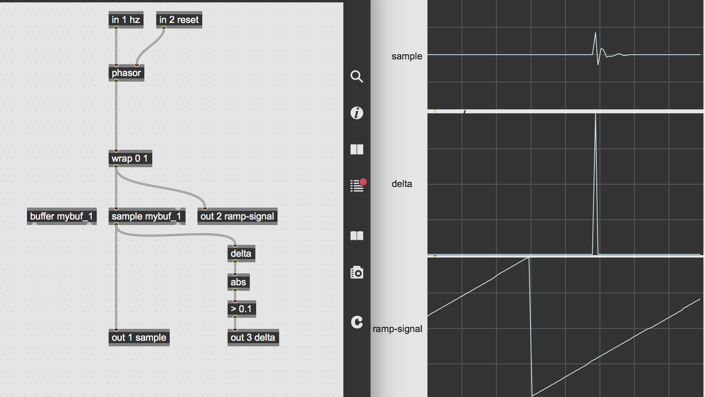
- finding the point in time of the transient start can be done by utilizing a *delta,abs,> 0.1* chain which looks at the sample-frame before and after and compares them in order to determine when an amplitude value is higher then the 0.1 specified by the comparator operator.
- detecting the ideal start value we can turn this point in time into a trigger we will use to figure out how much time has passed between the original start of the sample and the ideal-start trigger we created.
## How to calculate the time to be trimmed
- using the same chain of *delta,abs, > 0.1* before **out 2 ramp-signal** we can turn the ramp into a trigger which we can use to reset an **accum** operator to sync and count the the start time of the buffer playback.
- we will then hold the value from the **accum** operator with the **latch** operator, which will latch on to the value = time passed between original start point and ideal-start trigger and output the value at **out 4** converting samps into milliseconds (ms) using **sampstoms** operator.
- the **accum** operator requires a specific amount to add every frame. which is a value we calculate from buffer-length(samps) / samplerate. the length of the buffer can also be run through a sampstoms and send out of an outlet so it can be utilized in the parent patch for the waveform object.
- 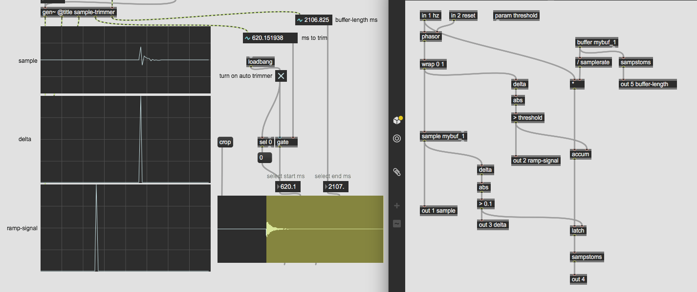

<pre><code>
----------begin_max5_patcher----------
3118.3oc2bs0jiZiE94t+UP4JOsU2dQHws8go176HUptvFYaxfAJPt6YRpL+
1WgjvFrA7AiD8jMoJ6oALG8cteN5xe87Sq1j+MZ0Jq+i0uY8zS+0yO8j3R0W
3I0e+zpiQeaaZTk3wVkQ+Heyer5E4sXzuwDWNMOJdST19lajc5XRVJkI9QH0
EShEOK+2+piSqmL+D65GUdI12KnxA2JwK252U2tHhs8PR192JoaYxmHz1cs6
KVnP7Z6WrbCp+zwYss0uW+S96met9iWlOJORqprrWifhTDYhHcTT565H.V8G
A1l.iUzTq9AmysfCOfXzYTw3K2AjttBQHo9SLwDf7KV1Pgn+DEeIYL.fywS7
YXsJ6CCts4GOR4j6ZzwNUlYkmYEchkawJS3OUIXCS69wq8vHJf3IggvxCg7E
Py9AAUs8Uzd5MfZaYdATYFBoSaNE9vReJXmYoPNjLayoc6nkulRy1yNXcrBp
7JDOY4ExN.u1u1Wos.QgtyRfwo6FZ4OZFF6xyX6h1RaOHtm7J7r75XdLs8CU
+1pR9Sw0P0b9I4soJYeVTZs+lcbW2srKqesYQGEO2pesLo9gFgewCsH4WBUa
euKZ.peEmPB7t1ViZ7fcQEZqS08PtWoZ87PaM3hZjfLfgWPfIBxz.SkUsQBy
rOhQAiRslmPnmaKzQ7lE5X462mRg5QxO7hsTI2FiQKeilEsI8ZWB5HZpBmNN
HwWjlOeHbxcRvGVfwo2zw4E2ZkGiDPvaPw6K.R5sIcPg7MXdQlFxMD6PIs5P
dZr0u.NuPeSjzqLgPeWiD+k6QhSOKZV7DB9RbGO3aE66RsgUGnoE6RRoukFs
gNdvFBRDrgH8OERlUv46.2JVTIaJ.1S6.NjHPndf6P5vUT1DzdI9q5K8CzZ2
PWTfWXy+MpJ9gj3XZFPk9IlOBNnNnrG2oWshhLNM5ykkE7SMKKzmnON1zBS3
5BILQGtFd8TidvKxqZaj5UtNDdLkIp344H8MQDFqpfO3kgO58+M7QURK5gKN
jG9iUVpp+A6bG8.kRhDPAQDeEf9rqjDG9ybkjAggRtEQ1oDG8VH4PpBwzTVD
Ts.7z0BHXOYwFX4WyRInZadA8rNvlS6NKzrgpD3bVInjajpDgBe9nVr59gG2
5e617SYBn4ZOFpCj.0GK5NDQToExO7Aw8lSLVdF31zEnwhrtaYFdxldEngZr
FnR4soIa+5O.iduIVdgx7cTL5zpHCbnYJxH5XQJ8UQV2h9xxGBuxnUr0eD8N
Xv6Nc2zxNX5J62GxKzH0Tv0CKdswQIPrL8tWRjdMcwho6wGYlxiDBJvn3gcY
hBEfgLuVleuYqB9bUEpyx1abPJz17m2jUognBnfELp.wUFRbtQElVNxH2O+V
RoX.dRqzOcod3J8JXQXTaAKuRb81wXZ1Or9urD9.0REsXrIvqu9H2Ofcuels
f9W.D8gBNDx81oIQ7a3PQxVT7EtpWRJ8cZYURd6h+eZUTQQqK+TqeRMy7OxE
unfWNeojL4kbOeoR56IW+Z4u2R9HmwG1mJk4s+Mul9UpJbnL6Th32HuHWrpF
RBAXc99UEpJSVEWUrlK1ZdAqZktefvu9qgxblbCkSejs6EVBWMYeZ91uRiao
UxkREzrjrhRZEO5TDSgfy2NltK5TJ6s9qoo68upBpt2r2JWdZ09xj37r5AQG
4Q8kaHGOoBo8PGvHdhrnhd9wbcSNiYfaxyHhcpZSTYs3R4txo4lr77zt257u
KktiotcQRV1UbQVdwv2rLY+gQ9sax4273Xuawcpd6Tl7tuw0LXuUE8dWtMKJ
MUYq280+snrDtCWJKQJBbrOeSoK6CUaKySS6fW4cdum6Dy0z2R+HIlcPU.4k
6ve7jhFknUmkxwI64od18Zrn8UcuxkV5d4Rm1nrjeiQ49npmkqNO.2FIohUc
H+iJ0C1nn0lAbYgG01xtsiyNWeLGn2l8VEW5U09t8E67ZemdgW8KtMGn6jGz
v464KK42qujgdpI9gxYi9YI7QrkqUmEYvjYNACybrggdOYjAT3RCeQ5PVmmI
qAgt8.PGaJ8BjZQbY2ZgXrf7k+0fbBmA3DNlhSf6nib8xNv7rh+sJeqxKyYO
bSCaiwU3kF5dwuwhqf7vtRcCLrhh6mkqzz5gzTsaHl1tgHK3550wxxDYgLUs
CL9gikzH9U3cwsHh1t8bA4fE+XSK9w1poTZoYGeAPT0ATBPFyEgiZMnhENG7
BVbcjMS1eIJzvLCjZoUr3Li1y9DX1gisoYGx7LVd+Geo0lG.t1guwR.U16Yh
bosh89mfohmgYFXe7mioRcrTr0CYvbt0uSOhZiJfrYsdt+ivAAhXZk.Uf0Em
cTbHpJubpYXfLVIppfnXoNxmgIgi0sSsHbEEmG1vPEp.ij852Fszf+ixnBKa
qoGt.YVkAjreEteJkilRsN98Mm18FZxMuXXthynbkW.yYbjIaJ6z+RxYjs16
tblAZvkqQ4LxdXHadQvhGTMIyBYc3OmJKwvlPRKnkudMN2f6NkVQYSkgXrRX
CawPb+Tx4BY0YAe.1OK4w6hgT7K21J9i6s3xzqkljMzjlHnQ886maTkepbai
DoYpNrr6HZhoUrjryy13ucos+VPkFSdT3.bTfcL4nvFJundTfL0n.3ffbyyk
WFKmTczm5.CMxHy1HiL2.npOXCp93BU6Ibw4OPGY1KsNEApguqIc+fgNJHlz
8iCT2OnPSNJfNHvFzGHBZTIjIUKPASIpDZIsnAOzPNKsIccOJgaLsrbMnCMj
6hy0.Gc02jZ7DniBOSNJvPGEHSNJPPiZt35JPGYN1KclFnojA8OkirdT9FUb
pz9jWQWmwMozHvKzWerNWr9MGaOg80za8r1lKJoE06u9JJi+3fOlEz5Y4CRs
Fqj83Obl3TreEACD6Gew4+XKE+FvJWotybs3OjN6dJSt.5Ap15o0iFBG4gdg
Zez3NO44wSorjpzj3KB0s4Yr3HVT6Q38DzmWib5RPegCjWlzyBBeLYur2RH0
Vy7Q20deD8NsdChbduXTuPuquCgfrOuViW8NKY6WqFb+551ytMcfMyl2k87w
tKqd3Ucau8sbK4ly8kQ+GoIUrtb0xSopHP28P.i3KcPJ2ffps+QCBxEuHwVY
r8aSbBXTcNBmdclVRihAu8f70pqT4t8lHckZlCiPo3+GWMsF2GndS7Di5rxw
88opPsTOHzHAJOkUDs8qVU7+em0Nvfdf7AHi5Z4VSjQQubUyPrkq8xvEL7Ix
4SJ7IVtb0mY3yos8tQ1K416Vs8jHFb6cmmlZUjm9coAszELvnoOnV8cO.3ZV
AXxE7R6Yrs4rXfGzK9M49V5sn5MrMWHJm+k16dMJWKt6dCh6ad64scl2iWlv
.LyRNloV07Pqgy7B2yInR+bR7c4j.3hH4ghXfuI7Gxrp2vXVwmNVXMbIR8ch
lLQDK1WZbDWSo5ukD69lNApEHx7hFjl7Nccbqi4z2itj4yM2LltMOl1bJm.M
2T7X9UPyI0zQzMjbG4otjm8MVXmMsFwH68nzSz7c2tOPufijrd1gfsefz7r8
CxO67jUGxKYvdzF9A441MHPml6MY5EUT+E3yj.slpmTPJUyC8LRyANGbnNau
K+E3HlqLQF.JEX040Cwd9wHtU8P7t5N09R930c5RwMuoCW0mdtW5m9Pyil6k
VldiDCLk5zWwgnjmFnTP..J0LblGkHKFl3uCx8fDRSD5t7NMQG7cnCVWDx4N
DxQWD5dVRsm5wGlP9g.jQWYDzsczFlzj9Is87HsG.R6SzA+EhUsVDjX.DRGF
09H.DxyQGTBhW9qFN5RAADoMhUA.Bi0A20i.Wgo4nLLItHOIioxOvIDI2bzp
c.oZMj19uTki0+e4ntnsXmEORo9fgjCDHoElGDBg0.gbgPo5lWWGWZdTxEJk
vykR.Bt4qiTpffHcjPEIXBotc6YL77nMDGFWIa0FsWJ9KfztzEcPKPHTQtnH
HY9flKkbAv5H5H+iFOCiSIecPIPd40g+CHoToinINP7e3nCMbGOfoiNWEOGH
BIecTpjyBk2KBR4JHczcCDDW5HcnNfbWnpSPPBU3qEHgg3DWG9gPNKT3ODBZ
lYylRPJ6QGkECoSgd5hP2M6nanirUnWcrOVShqNtGu5nd71i4wgOhGu93cTb
zN12w5XcWre9ue9+ABUr9cA
-----------end_max5_patcher-----------
</code></pre>

- this patch works great with this particular sample, and in generel samples that has a strong transient and silence before. however the question is what about other samples with a weaker transient, how does it work for those? is the patch also able to determine wether a sample that is already perfect really needs a trimming?
- idet patchen ved at anvende sample operatoren efter at blive genåbnet ikke fungere som den gjorde før tænker jeg at jeg måske istedet for sample bør bruge peek operator til at gå igennem index sample for index sample med henblik på at finde det precise sample startpunkt for at hvilket som helst sample med et meget precist threshold, der gør det uafhængingt af hvorvidt samplet har en stærk transient.
- 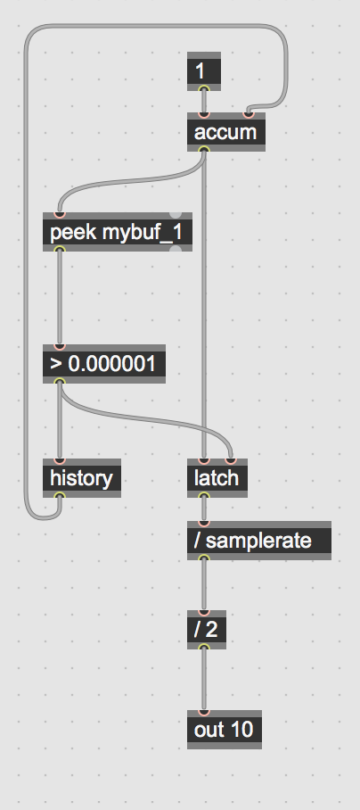
## one parameter sample trimmer
- from my previous peek based gen algorithm I replaced the "/ samplerate, / 2" operators with the sampstoms operator.
- I also replaced the value in the comparator of 0.000001 with a parameter variable called threshold, this value determines the threshold for when an amplitude is considered high enough that the sample start point will be set there.
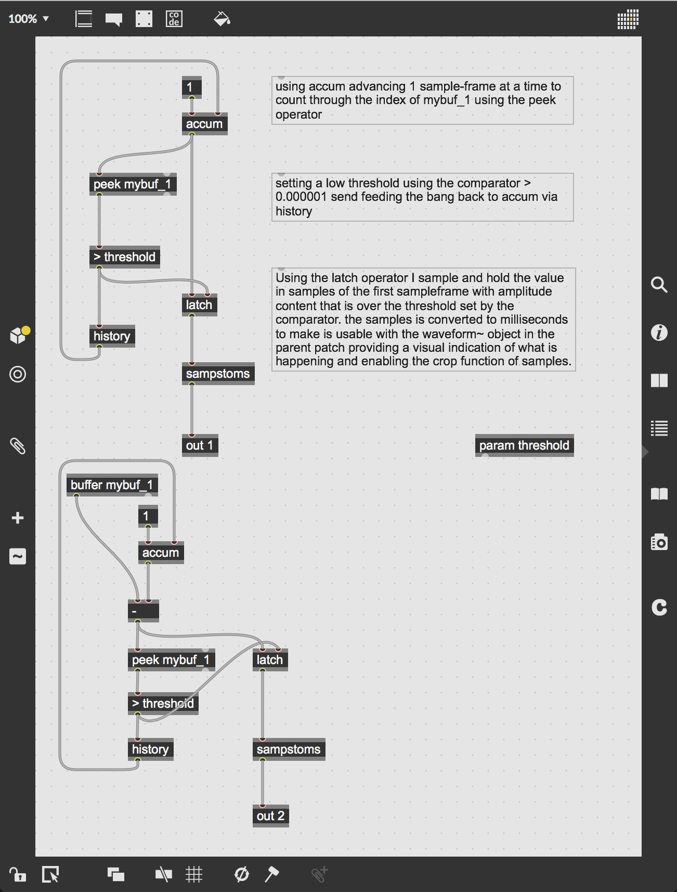
- in my upgraded version I also wanted the autotrimmer to trim any unnecessary silence from the end off; this was done by reusing the same algorithm from before but using a combination of the buffer length from the buffer operator and a operator which would count backwards from the end of the sample.
- using the threshold variable again for the comparator value and with the same function as above but this time determining the sample end point.
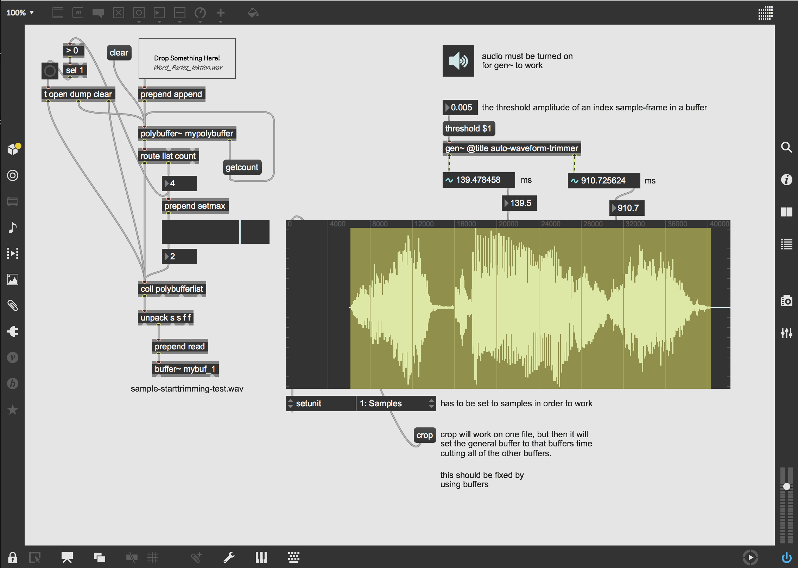
- the gen~ auto-waveform-trimmer patch fits nicely together with the max object waveform~ where the values determining start and end point of the sample from the peek index analysis in gen~ has already been converted to milliseconds (ms) which is the value used by waveform~ to set the loop start and end point.
- adding a floating point numbox via a threshold $1 message box connected to the gen~ enables the control of the variable and makes it possible for the user using one parameter to trim a sample clips start and end positions with surgical sample-acurate precision.
## Cropping
- as the patch is currently cropping does work, but if using the polybuffer and coll setup to one buffer that is referenced in gen~ as I did, it will make all the other sound files use the cropped length of the buffer which makes some auditive content disapear.
- fixing this issue is a question of renaming buffers in gen~.

<pre><code>
----------begin_max5_patcher----------
2952.3oc2bs0iqhiD94z+Jrh1G6tE1bM6CGs6i6Of8oQqZ4.NIdND.AlzcOi
lyu802f.cfDCAnilYj5bvFnb8UWbUks4OeZ05soePJVC9mfeCrZ0e9zpUxlD
MrRe8p0GweDFiKj215vziGIIr0Oq5iQ9fIaGWFQSAGKKXfsD.qLOgDARS.6R
yA6II+BvRAuml+ypGLllPBSKSjOMR2HMR9tR296u.2TcmIkGoIwDlj9PciYX
V3AZx92xIgL032yw8U2mA1tuZ8L.5ZI9w19UKv+67KJsjU8lrDM9WO8j3OOe
mLO6.s.TbHsLNRv86nevY9seBJK3CQv1xc6H4Elx41vgx4tA9Bl0y1R..KKq
GlmlAdmFGKktBIdZh.AhIOyYbFfcfj.nL0sTPjMHTHH43XMxHTMXGvrJfBvn
GIfvRFSfdX9yktS9Xo7+jWcWu1IdZeIdhPiDOc8sE+fPAheb7mT77Hon.umz
IdV0nhDrOyHpw0500CflVJtcxenqvet1M3OajhK6k8fSpkB24vgbB2XgaqfO
lESYkQDgDFy0SRhHe.JDMSdYWNlqFPS.XsHe8k7tSvH8R.sBT7t7Gj0jJa2E
mxeI8KEeFrdKNYemRSGu00CdA.vH4uQRvaikOsktONuROxIgnoWstFDv8+dD
K4cuqnPrwVAJJ8dqanPflP88yJC+C3vz6cbFrdulMskrou6Bp2ernKs2A6YJ
v2SvAHnxl0YFTd4ugsj7e0qrnftOAGKzg4p4BMqtDMVqqU+RXEz+P9vxAslh
oQjlBK9K8J5xnFurDtMgjN+6bpXXzKT46CUPETFOfk8sTpaPjc3Px2gwu8FS
L9Gucd.OBAeAnnLwmEC86h+clW92y2WpS3XOar+fb.frGpC.eKqFZ0yhCf2w
mHBzr1EfZ12ZCuiexa3s9cVqbK77U+GwzB4ucGPS2N1c6GUr8UvgefJNXs2w
9wEuuIGia998KpmDDAsVV+hj+HBG9qtLB7G473nMx3xcq96TNIH4c9P6Bi3B
RLneEeoas9TpsQCOJcoSJoItsyL3ppGl7G.qdYQZR2509ii4Pdx+tQJMWl.w
zIWTvv4LVN8He3t+EFof8J2uWWZmtC0EMzQFilqJCCn2l4HHstEcxBs7uXT9
6FfKYouT4K+EIqdNEpq37R+u5RJO3jspB31SUSlM9F5qQ9p3iVE.nQ.tKHZL
4DO0eZZRCBuZMNKqQyqZ7HBX62SkunfmqahlnZxstobxI5Wes72aNmgXbtoL
W4a8Cupolz9pySJo0ZnRAndHIEUBexEYZelqiJxdkKfpdAqaL8kizNPM6kaf
s5hfyvDWcXebZ3OIQMhChKEyHIzjLdBTbMcLSO9q6NhrCWFydq64ZZ2esm8t
5ry4VVsdeNMJMQLHZIMDMWQNt0ftbbMYF4cjfy53g4pYbXomN4Fsrxhs3bgv
RGTHppSVZZb6tpetXxNlt6LZRxWPQVZV+clS2e3JO61TdmGu16V1SwakIpde
iqWvdqfaV199vwwZa51u9Ov7D8wLhnjXR10ptSUfwGJBySiiawupdN0QOQb8
7Px6zH1gVwUH5ge6zrJkn00R4H5dt2w1swv6KZ2RA6SEn2noxsZ632XDtSWN
Wz9F3VH7v.4I++dg9FqTzZB.mKOcS65lNHa090bT11YoLEiyEip48zeAHtHS
W6lOWK+hVM5nCeiNHU02BjAqt4hhQz27fqplsP6vY5AFwTjEb05hQBIndgD3
0gDjkbtROeYzN9VONPRrXvNR3vpW3.YDb3FDzcHfeevwAtcaZ9miCPpKxwf0
O3.gas5gyCDd7i60MhcvchI1RiEufGGLIiP9IncsB5uhP8CL9i05QALZim.S
TVPKCv7xHUQbtSjvA1cxVeepHvQhDVicN2M5JFnJ8wlGGiEbXXcMSGJZ.Gqd
gFM31FtOVtS4TDzJHhl4iGbmQW3aqlN0j.trlP9scAIZyv+W49DPr1nx.M.7
Lexw7YXA+G8hgBvIQ.4pjItoS33R4Jip5rnZ8w2QyKX5FUqd56T1gFqxZHOY
N9XPsZ6T9ycRr56sVRVwRzu8SYi7QrHFY933U40UTi+f7WD+QYjHwZ2ejFGS
KH71hJjWi+IQbSkEhzPTiAwyWWXYfJKOAGHZmSDwfRJx.Y4omnQxE9GvykqD
GKVUXZnL8VAi9tdrefm0uH828RrQlxSEHJ2SB6JSBqdF8H+0lfeqsMfeOJa1
iVYCoq0gpTzarUEa05gPciKiUasBPb56Mj8k0pgmE8feHxRT7ePttAGo2QHQ
U2lnhm7+D9SgXW5CiKyvfNBOrqMowEnM7NQansdJN3W2vFeifsBTUfCN5DNI
TbMr8tbfqRiUa6ENPJwIgXIsbuxxQsuH3Jx53oZHojgYU4uXnHNbych3JeoK
OfOeYuB8GKj.UAXYCsezxdULeJrm4SctW1UU+hEe5zqvt5cU1cm6AZrgYpRF
yAI+IH3wI0ioImrQGvoKpgW5GoTxtmx63NVzPa.gb7+aU4cbFsGEk5Ax2+Qq
7NiLOUG3XcfT6a8uS4oduFJ9nGs7Tu6x9gbuSaEK3cU1uyKImHZwdVnEI0E8
2MXUjVlGVwoUdDAsGIQjBdBG0qP4ucNTKwMZjvZviBGCGEB8Rd33MuwiznrT
ZBSCHdxMRnsZCyn1xUst.Ez6Epz97ka4XjbC4OOLKxPlUT8j4CxgCAxmsQgk
gihJPaVFEhE4vLr.dK0uMAp7Ipznb+xENV5jeOe0bwTAlBsVWvTo4QpMzg02
6PqCAS8PCNOCMeSGZyowosodk6v88bK6LdBiEWz4LDE9kEzLd9M+EG0Ldd.G
kah4YTXMDOvykYGZPlcKpKSyGZNKsFDZHJPyknCZpe6YcPXZfc8GRktQUKS0
oTLlfyG1w0x2dn6QXHzWuh0cVfwIXSB2y1nMKmjIVpiBBie6CjMG7o2Ep26W
p5.sYV3S4QWXbmIGeqQelbtByp1VnK5IMbOgoVOjAIO8F7oLDopHNbi7G24P
ddrLlQKhoQ2Pn1MGgLQfJz8oIB0e4qSUQ61LwkB7zbZG6D40hkcNByvFpan1
GzP0gT11YINyCUV74Dbz.O809C1dOPsZYJ68.qkyulZgQ9Ev3SvUuNEfdikq
82XjWtIT1VljIVg5B9+uCr651KWdX05j6G7w1C5o3dK0F8eyM3dmE1GODMC9
3sUEtdV7wusjwRSt9IwpSFcRmLSUjO0IzBU+242NNLMNFjkF+oxfVcXJugZc
+SGLRcYa0g54lmoGmpITvmHQuo14OugEm8JtPTUy4lmwGBWKt8Ynf6aNr9v4
3M9XY6ALy4iUBPfgfaDdv0PwtOkX12DEg9ROBA2BEsmNFlI1tHIfnxiYfqGG
u7.3v4XwsJ9Uc2cdf+WOJSG0ZiCsbmAtOldh7ZTiulJmvmOCyWzo4gOYeMOH
vwYKAU3fiZSbacyyGWDILMhTcXggsrvpMsthQlbCDlt6xSK2YdhlzwIop4MD
mlruW7r0cVbHMmY1sVI.bdpYVrSo4dUjdxcO3.i0CMRWkJ07MdKXFr0SNHh1
67UiL7fQx2P0h0p0qM3beN34HtT8PRg1KmoBG+ZkWzn4EUbYSy5vYPcmtPfY
JgZshE8PnMSDctECUU+56hPhJ7bSNBNEDBZ.g7PSAkrLfReY3ztrsyLo6lxv
6ixFPX6o.c8bLWgo9CeUq0FUryScq2l015PwackNBqtuBoaT8gySE898wRHS
XoIA7LgP1S.gbMv+gu0DQnaZUOAzwwDnyYJbw6XhBdvTPHKSl0ZJlMwYoDR7
2AZgnCbAlyp89NnOBIFM12KkbLkRn6kRF4raJbMXRjESgSUzBEACzj4XgSg9
Mz0Tsg6lR1lXJ4OETBsPNgflDC1jfcF.cdSEgtEC4dAcTIU8kOyNBR7kOuNe
4SqykeVc5+SpyW+b5H+T5z0mQGQ9vO8WO8+Q2Wnug
-----------end_max5_patcher-----------
</code></pre>

## exhanging accum for a phasor
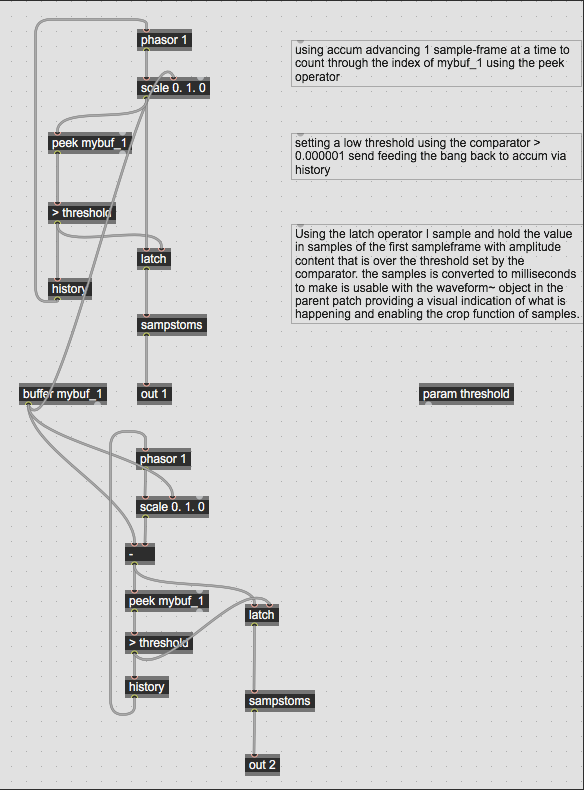
to make the patch more effective I exchanged the accum and 1 operators for a phasor and scale object and further utlizing the buffer length attribute. This give the same but maybe slightly more precise results.

## Bug gen~ and polybuffer buffer reference (FIXED)

<pre><code>
----------begin_max5_patcher----------
2930.3oc0bszjihiD9rqeEJbL6spbfDO8dXhcNt+.1ScLQExFYaMMFH.gqpl
Il929pWXKrAWBajqo6CtZj.Tle4CkoRI9qmlMeUw6j54f+M3afYy9qmlMS1j
ngY5qmMeO980Y3Z4sMeOotFukL+YUeLx6LU6eTVj8wplMaHUKfscmQyIqKZx
k2CR2XdydZdFgUa1HMU9ZJV8Gu.8me5NKZXs2JT2ppI1GkDEgOeN320cUhYq
2Qy29ZEYMS0KDhV38LHvS9mPOwu9gK7.+t3Q96mdR7yyVx8XFqpgNuOFA1Ci
bDGJwU38DFo5URNdUljv8lPlLvWxWn.ISh7fx+fDbo9gDTtjv1QqYEUe7ZDJ
Y9Mf.bpcEo5GysTVFzdiaJxY0z+TxMRIh9cWjRNS2v.LZasltUhXGeLwaKmi
nxw42pn3r4Cga7mMWzMX9lrBL6pvXDLZQHWWYYj.+fd9W.ihAdCdsR.5bEnH
uGkBT7RoBTXrTABpLS5WAplvZxoraQ4YHmGaI4bOG.K7g3aodWXxj5CQYWED
CO4CIX4M5CIm7FmBu.CJqHkj7T.Gd42tsZHgQSIeFEKE6KWJ9yxvS5.2hrtI
iQqynojJqYlPaT2E.DMWfQJYijJMTT62ExZtgaJlguN37rI.UTQI4LLiVjaN
9Cha9nkJiGoaC+foU+ntrhx88z0H4eYsqj.+oWQwOVxoPEee6ZJC3UfKnA+B
z1YZPISOCFfT18PmveZudifEgSpSsnPEOJmrKBcW735h864FKWvi3lTZAXeS
MCrh.XMU4jTPQNXSQEfy++.vJ.uUT8c6CXru3rV1OtbEKVTRrXldejmw7c99
SL2y3AaAp2UzjkJX+Mz24b+pO.M0bpAnrgquKV2GNZVOVI28i7EHfqX80UEk
f2nYYRwqPjWjKPfLxybFmAX6H4.JScKBKcdCBMBRENSiLBcC1NLqEn.L5dBX
cCiIPOL+4J1HerB9OUs20B6ianG7DgtY7zKRYAknBUXhcVHvSa8S.CmR+Dw9
PC9y2M9IDhQ1tJB2Xgaqf2WlQYMoDgDFy0SxSIuCpEMSdYiHz.dS.rVja8Tf
I2rahkpozUxVgOiah44IfvGYqI2nwG7eqx.+MS2yGpNIM0a3Nqv4amajdS0d
rj2itBnvSeVBJFYTO4SNdRYv94GCBlR8dMapiAHNzI586qsVcX7dlBgIpzYU
g0GbWJuiMweuepx7O.563L+Gmwu+xa23epryChQKh4fRne3DXnOR9O3qm+8g
KE5DgJu92I6e+N.P9i1Afe.xPq9Nc.7F9.QfaGcAnl88nwX+qdSGtJrmXUFv
mczPBSks7yW8+jQqYcykevT7Bijl5Q53ZB7LL4aWoKg7v8dLW9SkCy1YGUqR
jKbXR9yT7ZqQOT73CtSGGCTZWDD196TtpMxbb+OLJmd.3FVwKsVQuvpnbOBV
G75.wt5+4xxK9e1HVUd6f5HGLEqxGhTogBMVvk17L6NvS+RuXYZNX1bbYoQy
yLdDA.9GExWTxyGahlqZJ7XSUjCzyes72aEmzYb5toRoZ+dTqmDssRUdC8no
qTTpIIoPSXRTWpUOmmVWtfKpZeAyMx9IPhDu.8TEPJQE06xnjSXBW2XaVw5u
SRMz33xjRRNMujGGaOKi3r4ojM3lL1q8at2s+i1Q80YuV2ylushlVjKHhNBD
QysC223o+qV+CSlQdG43xddXtlHGYFnyZNS1TuBWIjW5YpQscxJJx510wmKi
rgo6tjlmeFJxJJGtyJ51cW4YWUv6b+0d2xdpesIW06qbUC1q0bazt2GNKSaf
280+NlmmElQDqLgjc8N1oJZkc07D2yx5vupdNzSOobU80j2norccbhK5ge6z
xVkn4GkxozsjZV21X3s0caol8gBzMZpYk1T9UFgmXMmK5dCbiD9zn7bvdqVe
isJZl.vopGaZZa5srS6WyqYWOmbOZ.eyd5yC4EgMd1Cb4DACFpjuZcaT+w+r
r8l0Ngf1SxzytxvbOsDHCx3d8y3AWgyMwpgSAdvYD7jyAjzWIgbOrHVymZtM
b8X0DNlt7zCHpELOVut.dOZHISPRCBGnAfCOGCGQ9QsU85wBG58yvn8TrzU.
BzSFBkV+H3gCH+pEdQFBTRbLnDEK8iDk7vcuRHeGnJ31XMc7iGFTPWETddD.
ix7I9g6f8kQCGANVGILQUNY4hu7HgB3Xmz02YNUgvH0dLIQkF1iVq.ud8w0p
ydMCnigiPe0xY8vcoJhEEMVmonjaNXz1PLRhbXvncWQxtL7+SVfZQQ4jQa.3
45Ug4SyB9u5pvAv4o.Y4YD2zAbVirjbpNqaKL6FZUMS2nprcuQY6LJumXW4v
oAUYdo7m6fnrucpEnn1vq9P1HmhEgIyoiExqaGM9CxeQ7GkQREEMdOMKiVS3
skVKuF+ch3lZpEIdonAwyebEMAp7ZEbfnc9fHHJofATVUbflJq3Lfm8ZCNST
NR5ZYB8BF8MMsuCWJS3eqDajI40BhxhguoIec6yno7Elfem5UGOVksaOyGTn
d6snVATUoNgddOP0MtLVUSePVwaFx9lipgmD8feUjWr3ePttAGo2PHos2lXU
94+r96BwtzIFWlgA8DiXe6N.6Qa38h1PUQ0QKgc2s.O.vVApJvAmd.muVbMr
a404pzX09sfCjRbRHVJZ1prbTEjuPraz3QT8JzPRIizp0ewjg3vk2KhqRr2U
.tKRgEF6r4SU6nMen+WSJrh4SgiNi9aVCnkcSPeMqsid6L8IoeLPPlHWl8wR
coOjKwS7xehxJC5RXIDY3i9wmS1ssBOgN1aAJH9mpU3IvYIppTOPwweMKvyn
ySM.55IR9oJMUWanD+Ekk5crvenPGaqnNQZex59cpDjhXEGnvRxwPze+fUcQ
S05Vpq0uHvqCYlRp4oabrhre6T3V.aEVilJBrjJDZm7fwMuw8zzxBZNqt8Pp
o10Bdm1SOct.kL3EpT6hkKyFxegyXVjkLqXIRbGjCGCj6LpvyRpnEzbBUHp1
gcXA7yT+fpsLPbn9X0Jq0g4EAggsmoh1qbEWkXK15cAWUTkp1DKdesjVORli
jFzMjVrsjlKsN8s0sbO9ucM.Y8LFCSYH2PYAiQg26gpva8DbwOb4o0SDDnbS
3FpvaLtfckYGZTlcOTWl1SZAOZMHzXTfbknCZqeamRD1FYW3+Dl6vebdA0jq
pko5b6kQvU1tIlimzCosJneXu0P7l1J61tWki8b5g2X3ObAAt7DoskvTkuvR
gYzjdZzfI5ydn5vnbmhy92r5UbRh.FESNvIMEY2WXggkjJ1L599vBjQOPVjZ
bvYOfOcbUtnyO8HIcMk516OkrtHkzdTMfNAb7k+BUaL8nNGXE7AR5qhuTKzU
bQ4o+W84aWeYE6K1b4dx+DyQy6YyZadCYE4aGDN6bm06JpX1cqsvQvSldmuI
WxexGZEY45Ss9zWM8ecIfpcVq9vYMw1xmNKV+nymLDq+1UM2YtogwQFJvcNb
IJEX0tw3JZuD9rQomlEui1g7c0cADUv34QYnAyKCwoSLNCDYgQpwWHurcfVZ
FgsEQTdyCThELzxIZb9LFpMyz6Zfh8sfih5jlv4Kiku5qeQfZFFn1kp4UH0Y
ZSbFnB0WY7oAxLLR2xGPKXiHooTbzwKtjRg2Gk5YAkJ9XTc2x1yDa2.lzJwT
EtssXcFW.iMgq3gOPrVSy1fNvovTtEhutbHbJFoPKFo.+oXjrXfhmB2FA1.d
ASgXJH3AMGRfMdPPcm.XhbIX0PK9VdZLmvD42r654+Iqr9cMRcWd9qYY6eui
TfsiD5dGIaTYl.rCk7n7JhFQHaSqlnUibXR+FA2m8Gx94IuqwAF9nDiPqzLm
DdxB+GQASz.8opGWLNpbXN6nyKFhyNx7mcb4u7nxO7wj+7iHu73w22QiWj84
S+8S+eT3PCiF
-----------end_max5_patcher-----------
</code></pre>

fixed by changing the accum with phasor circuit

<pre><code>
----------begin_max5_patcher----------
2873.3oc0bszbqhiEdsyuBUTyrKwEh2zK5ZlkyOfY0slJkrQ1VcvHJP3jzc0
2e6idAFrAGgMvsRVjDPBz47cdnyQGI9qmVYsg9AtzB7afe.Vs5udZ0J4sD2X
k95UVGQerMEUJ6lEhwJpHVOqZJq5HIKEyjsA02jjH6Icye7BDV2ybTA5HlgK
dEmg1jhEcw97agVwt70ntE6ybrh9rr.+ulWFa6AR19WKvaYpV8bsWa+LvwyQ
9Gan7O7KZdHAkKIrCjRFs3yWCbhrDM82O8j3WOaHBvo1M3he1KD3bMD3U2wc
zLVI4OkbCTPk52MMA29Q6BF02sjrWhXMOl3skwQT437uKHnTqgvM9ylIZFXs
KkhX2DFCfAq8eF3EGHvOns6UvnXf2g1pDf2A7MNEn.6kRAJLVp.4GJUff91C
q.UhYUYD18n7bDWVh1iqYJF9C4vasGmsoZG33m4zzO4+2Nbw5FamTRFdKsJS
1UWC067irlPzAprq7Bk1UJvwKV.N2iED9cNEdEFjWfywYI.N7x6toZH9ASIe
FDJE6wwh+D6eVG3dj0UoLRYJIAWXLy3ah5t.fHYBLRIajTYKE09cgrka3lfX
naCNO2FfnEDbFCwHzr1i+f3lqSrx3Q51v0aZ0OJyKHbeOcMR9mF6Jwyc5UTb
CkbJTw22ulx.dE3BZv+.Z5LMNQSOC54nr6gyB+o85MBVDNoN0B7U7nbxt.mG
hG2ROdjarbEOhpRHTvwpRFXCFvpJxvI.ZFXGs.v4+eBXTv6zh250YuiowYE2
OtbCKVmnPwL8tN1sluy0ch4dFOXKP4AZUZhf82Q9fy8a9DTUxoFfxFt7gXcW
3nY8Pkb2MvUf.yEqusflCdmjlJEuBQNMSf.o3m4LNCvNfy.DlpKBKc9MDZD3
BTpFYD5FrCHVMPAXjiXv1JFSfdH9yQ2IeLJ+WE08Zs4wMzCd53b23ocfxBJR
EpvD6rPfml5m.5Ok9IBcgs3O24wOgPLxNTf4FKbaEzw7TBqJAKjvHtdRVB9C
Po313W1IBMfeK.RKxMdJvn61MQrZJckrU3y3tXddBH7Q1XxMX7A+WqLveyji
7gpSRS8FtyFT1dqVo2TbDI48fa.Jt9JPw4bzvS9jimUFLe9QOuoTuWyl5X.B
8mE89ikFqNLdOS9vHU5rpv58dHk2wl3u82pL+8ftybl+iy32M99M9mJ6buPm
0gbPw20eBLzGI+68qm+cgwBcBekW+Gj8ebG.Nti1AfqmSKs5GzAv6nSXAt03
BPM6aiwX+qdSGtxumXUFvmcvPBSks7y27eRIkrt4xOXJd9ARS8.cbMd1sL4q
WoKg7X98XF+sxgY8ripUIZNbXh+yDzViQOmvwGbmNNFnztvyu92S4p1Hyw8e
wHb5AfpXzWpshdgUP3dDLN30Ahc04qkk5+yDgoxGGTGuPago7gvEZ.Pi.bYL
OetS7jtzKQlltWYgxyac6UsdDAr8GT4KJ54laQxT2xu4VE3SjKes72aAmzYb
5tpPoP+QPs+CsERQVEowfUJ.0jjTTILDJy0JkVIk4q4Bn5WfUqbd7jHwKPaa
oegHUrtwAQmwDtFw9T512vIszy3RhbbFIKmG8ZOKd3JqD7NTUJ609Mx61di0
SeM1qM8Jq8EjDZlfH5HPD2td39AOoe0pdzlYj8HCk2yCy0+3Hy.MVxYxpxMn
Bg7RO+rSciLJMsaSMOWJdGS2bNIK6BTjQyGtwBx9C23Y2P4Md7VuaYKkuVko
Z8UtpA60RtkY29gRS0l0ce8ef3YWgXXw5QHYW6lFUwnbnjmtdZZG9U0xodZI
gqpuE+NIgcniqaQK7tSxqUhrZjxIj83RV26wP6K6dmR1mJPu0sp1nMkekg4o
Sy4htcfajvm7jm406k5NVqn0F.NW0z1l1s8Q1492xW4Eq46VD2So8Z.bMvtc
O53ezsUC83ib3T.+hz.GboRciaMYWna2HAWUOag1gyziJ4GPkzB.bP.A1OfD
O2.hmJFJ+kFPdH0jfYCUTEJHL36kVh+LiG57mVbkDYlimWUwAgE69gklJlM4
3hmiZ4Dib5qNqKf0C5XdIeJxxwpozrFTSNj33IWppfHYoDCsWZHIUPRCBGNC
.G1yMbX2TJ4kENzaRnwpe3NeS3npwbfZYX8Vb.42MvOxPfRzbCJpBzDDs3NX
w32.ppXOVSG2vgAEmaBJOaNv3q8lr3NXeYzvg2Lqi3q2Yfxv1VRnfSw.mwZx
3bCSFai7bFp2DNyinu6h41kg+uxZ6KpmobNE.Og4BD2YJ3+nKfI.kk.jU1Rz
oSnzJY0LUMVVWS6cjhRl9lpJd9NgcnUkQEanINMnpPNg+bmDULuSYTEkUeym
xaxoXQ3Pb5Xs755Qi+f7WD+QY3DQ81ORRSIkX98RJkWidCK5TUoH6UEMHd9l
ECFnVb.AGHtOePDDkTv.xKnmHIxh0CNQJqPohJ4R1JWUDAi9tl1OfxkqZxdI
1HyTtFDk6ifcUYaqeFMkutM32oT+giUYy89U1picSEqupJwPa6ETciKiUaGB
PJ88Vx9pF0vyhdvuKVbAwOPttAGo2gwI0cSTfD9u19lPri1ts5HWlg.8DIPe
arByQa3ih1P8R0GC6tQKV.vVApJvAkbBksUbMr6NSfqRiTaUENPJwIgXgVsW
Y4n1KCTwF4iOu4qvVRJ47o09KlLDGF+nHta7bB3yQhJvvYNmVWn6ulDUDymN
5L78taMfZ1Ukpp6hGIkdmf8EAYNPF7NyYLlcxgOL9aTr2v4DV7UGf.UJIKej
22Wd7y9JfoVmzuM4w6MaoinTObBC+1kFui+LiI1ljE+450IhIXfpvHGCQ68C
Vkzphs0Tm1g.vtCUlfK4QU1T8xebFB.lJqFKQDXHQbMwRKRTUlFNKDligDlH
G9gnLmeoTl.Zg8SX1+RIrngIr4QVJV1IyDlQynpdOZJCPEgKsxdzXT1gyE9D
aHUbc+NRRxojLVYccJUqFjJZcnZm9z8J8QmE5E2b0LwVwivpXtnAOSU87+Jn
M.J27T1sxPryEvn5SViu5hewya34Orsz73EzeDtmmKzAZpCOuYjHbLEI77V7
I28Gi5yhNIpwyRHJC4xpY6Z7zDwKs.0XRShZKp.sG4z.jlybNCfoAm4LqyCY
pcWsCrdyE5oy2YpNlcoXTgo643vI8LUq1d9vf9Vns6Zmma5VKNzdVOqEC+cF
vaNO.Y6wL0RlanvLXRO7XvH8QEr289zzr2xK3jDFLJlz2Z7RSSjjJ1L3w9N.
jRNgWmz5btdBc9zkbUie4IH5VJ008OAuklfqOYEvYAbbCU4WHUyC5b9RPmvI
uJ9vpP1vEkm+uxK2m8xpDS2c8lo+LyQx5YWV2tCozr8CBmc5Y4AZAyrtVCGd
O0167c4R9K9tnHKQbhwGVpo+iAAzNTcF.lCa4yGcpe14K7gweporlM2zP09Y
Uq.24TgnTfU6.fan8h4yFkbNtpNZGx2U2EyTAiWFQgFLuNRB21QRLTrLcV0v
KBz6JInoCcmku5KBN+gFHnArn+DMNeECE3MECjuAbDbJFIGSFnoXbLRF0Uio
apPy6PGMGF.NQKkXzHi7oXb7LkibdzQJ1zQx8AGotY59EYp+XijQhoATEeLi
.OOyMBdrAJvfAxaJz4MwGY3TL8huIiTsr8wFIS.O+oXpr.6kx0Tfm4Swz74Y
oaUJhkekYbTaWh5Rj25BnZeFEJ+5TJu3Ao4PSPG+fI.cBceTzwU8cpJnMDzI
MpIxChQT5EB69IUUojbfgsJrj9JG0I5nVha6tdVhJ8qXiovYerIypLIAKBuK
W6pLKt3jnKFiKNA5Wb5yu9jmO7oN+xSbt7zl22IMWjS3S+8S+ev+xgIL
-----------end_max5_patcher-----------
</code></pre>

fixing this bugs now also means that cropping works and is saved to the correspondent polybuffer.

## fine-tune adjustments for start and end
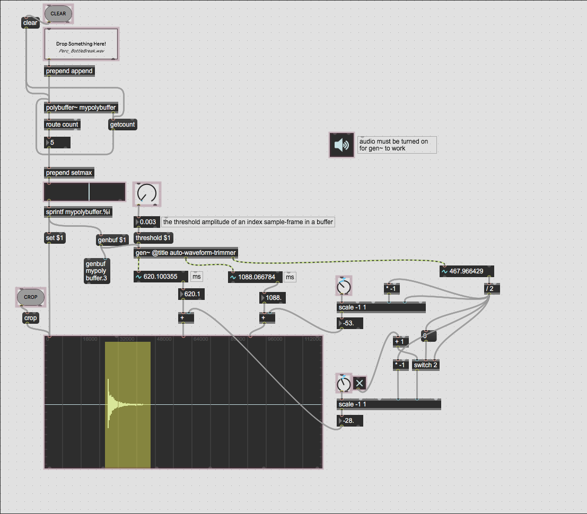
the thrshold control makes it easy to quickly trim the start and end point to the exact sample-frames however depending the the samples form it the trimming can sometimes be a little aggressive. in order to prevent to aggressive trimming I have added some fine adjustment control that allows for readjusting the positions before commiting to a crop of the sample potentially losing sample data.
in order to specify the range of the parameters I needed to know the length in ms of the selection of the sample, which was easy to find by subtracting the sample start and sample end from the gen~ patcher.
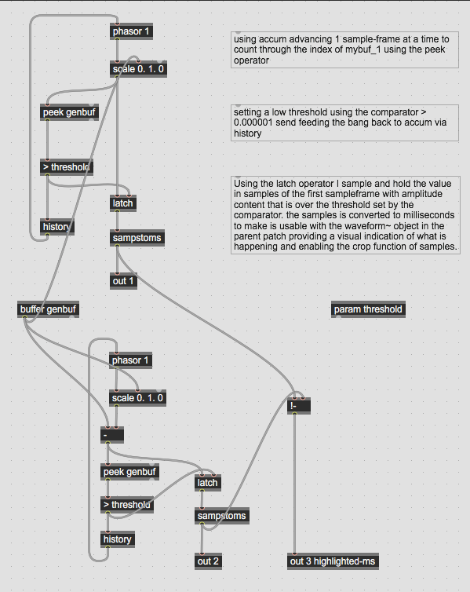
I then divided this value by 2 so the adjustment selections cant overlap each other.

## Implementing layering techniques
- in order to make it possible for layering multiple samples on top of each other we can still utilize the same polybuffer and add an extra slider to the multislider GUI.
- then using unpack f f object the values from the two sliders can be sendt to their places
- in order to make the buffers work I am now using genbuf_1 and genbuf_2 instead of just genbuf. this makes it possible to run to samples simultanously...thus layering.

<pre><code>
----------begin_max5_patcher----------
5347.3oc6c00iixbk95Y9UvZkbylt6P8MrWDknnnnHsR6pWs6Uid0HZab2jw
FrL3dlIQY9su0G.FbClCMEX5Youn61.lpNm5TmOqpd9me7CqdL4agoqb9Ob9
jyG9v+7ie3C5KotvGx+7GVsO3aq2EjperUAYYGOEs5NysNbLLMLNKHKJI9yG
CWmYdUbOxCX1cNDg6Cx+fXtO3dmCF+fqyul+MiOsOJdWXl9shxuXzFcaj73e
+dDEU1HAGC1GlEd7ygwAOtKT8LtmeMImxt78TsaU85lGM66GBM8yUqJ6OGBx
V+bT7SUnBOhtaiPDe8eafJTbCcWNKZeXZ1wP4KYk5V+qO9Q0utCHWMK4omjD
V2bUI2jRPp+fo5dCsW7T7DvSihytJaUvEOHTREHW2BRnfPdCrNIeOM3oRdWV
32zsypcIIGb9MkBQ03M3l3MjUWk96mryYhzH7P8NK6XQhzEN4QsI4wo7pSMv
9ZIx2J0scWhrSATmB0UqS4MoRg0ewebuUobmypGChe5L+aaxw8AZpfeEAFWj
giZlTTk7dCbz3vuJo3WItjF8zOVAlaw6oDi7sGGr65SKJnRibCAMJyJRCy50
LegUmZ3g0177DlI9yCRzyljHyy0hjXKxpOcLI4kvlEWIMQh9qt5D31DWuqeB
tdZE4L7fH4cQuD9vSAQwkj2KAGikZjt3teB8qcoUDKzpdMyjxsxPcaSqXAyH
84juVzdtMvLYW04KTiLZVGZJkTujsFDGGtacxo3rpsc2CN2YzrJMUHUkdmhI
kdc2L3DiPJxqBqAQ3UXMoAuDt4yJe3hd7TV34+KMerKevSM7r6TXx1hKWb8p
rGoMrmt5PXsmduTdPaQ3A2Fuajl0cuvsw6KG9Nl0Pi0TKUvTa58bJNJKM66l
QUp49ZQ4h+Xmox+dGLXMULbO0T0k6lHrqYnmgDVvWEvdpq7UA6iuzCWnVeYj
Yfq59biVOtO4xPNrmzwuyAtcLF01RGtRMBRWJO+iORQvHtlfGlrRadg80HY+
nk4DMYZiwro0ajq.aFU4FOow23PSXb6RdRSzJE+bW13MF9u6beOjZESjTqY.
cjjZWGrKTR0sLak2DcaUuN8kzkmekeDBIMKHLsvrOePDs1F5lHkiFs3Pl5l.
7GqHyWHiqXZSNjN072o+X982er2TjqF+qJ6rR+gjgxVuU.OzvMSDafGnI2S6
eL7XUBdjcGSO.Rup2Xnq6MFBpyXUDjda9hgFtuX0SpRm9avce64FwV4.okY3
b1kI74FoGmirtdbjuE8M0dZt43wWyMigL1oECin05Q9A7AwRGq2lDmkF8OLS
3vEysWsOYSX0ubyx7xvR0SLJ+Zp2VoVf+zwJlRtRvsWntsIQDjwqaD0j8eoo
+Wk3SUSuMXsYl53Y7i1kwOgTguv9F+3z2gF+XtrV3A2NierEiesX7iMWM9w7
viW4.9cvUZxsrkOgTalt9XLSvniikudPf1NDMtIirVh9zSrzjUaZnU2raMzk
IlhkmXGuWodpj48m+k+q+a3yf7fnitvzpEK01UGDHXlY8GXTCynuVYrMU6Fp
z4X5ZxmFo5dx+hK6hcnit9PXy5ngoBthjRipfwCWCKPeFXc5y.wUqHHOUoFE
cTxf8Y3FEvbvgCgxFL13LF4J0PipSXAhf8Zgtuc9IvupLn6Cn2ONBzV1IeJL
9wSa+L1Y+2Ojr66x+ea3wGJUhsKJNrrHUzljfa7I5zLiv0lwUQYDSnAhJqY.
tsid7vQosts0YT+1HvVFDHaRxDQdc7xygM1eNTdcAdLnQJFMhqffxY.8gNs5
ZjhxcqRmB1fny0I62Kmc9J5L3zlnDm8mRybdLzI6zw3vMNIwNRmxcj7fe3jk
370jieowo93Nm5iAOOnkRW418RIgPnUV.hDhkkDVeL4.bQ.qVKJBwXEL2KYB
dTDAxdVNv+rbH74jcabB1eXWT1oMgNIacBhchh2D9MmT0kCueqxPj7RNANFU
cv0yw683Ky2ToJheN0aRahqUVFcc2gEu8fdku5n8FmcOmALaEIboqQ9HKD6a
aR8mEH5iBP6tNpxIzwUA39T3hD98VF1yDYKh5yqrTGbmnj4549tJYtBI6wvr
LEsbDxkaOUB3gt8Y95btfL14F3D99xAv2dNPwZUqHOEt2ZEAdj96rBiTU1df
JB9pLLWEq6Gcj9f6MMiIYa7b+Gps9GMlwKmL2b7d0XHrlXHs38Fuu4LnbALd
k+Qu1FuCPTBryKUIVNCmUk1kgwnBntLV5wVaL6ck13Ryu9zwRabaqsYUbG+w
rHYm2I3TVx8Eh62mcLRN4EtWmdsj2ZReVXs.V+yk7Jpof09hWwqzeKSxpplF
psQ6BeI7XZ8IF5LkU4x0yP09f+dh9E4UlhHIevbIV4kNF9RzkuV468nrumI6
3mNZDX9VY8Cyk.OFeJpV5kJ5R5wMkfV5g7w7UaRO7fbzp3ErphUKpVK88HWW
sVGOiS79pTpWlv2UO9ztj0eIbS07csJ4PXbT7kpLJu8lvsAm1k84lmDU+9kB
mMcyFmy7gUOcLZSRrpSTa.Qc4hl6SRaQlPNqRL5mHN3PCeYovnjyzxMSkD4o
zGCNpFuxMrhKtYVRxt52p76sKbaV9sODEGeAWLK4P627XzSOeku6iIxat+Zu
a8cR+7oXyc+rZ0q+YUxWq+bA61kOGu9q+aAx.jBxBU6KPM45VdSiyEOmJC6d
2tZzq4Nuzvc1HE0WG90nMYOWS0n5NxGO5PgPzpxQ4MQOEllU+ZYAOkV+Jk4Z
sxkN8X9T4OmEJCJVRE0e.4jDoAJU5oSyevKxD+EaqzpSsqpvr10ulhy5JOkp
zbHNOKGf2oFjC2beoiMspy700G3huwq8woU6tbspOgwZABIp6qVkDVWXnvxz
++18sRs3VnVV6TaUFT6Qu1AynXwNbQQNGedgYoM49fC5AG2VYKjlYKdiEWQs
61T6TQimvBxTKgb34fzjikK2KvyJ7GaFB0HsvlZFxfDS3iFWwjYeA+8kTBaj
4G4EDcxERzg+eNOwsxVbalsTt+wsNegh0xFDyRAxe5m8Dr+Ppzcodaks73Fv
5rDLUG7KmZzv5N0rjcptTeMCScGa1gwmDSVzlR1wyR+ASN989JePFOCNl5By
MoTmN4Lj+..8HswT7FalRdxx7lbErggewonry8cxCQzNaAeU1xcvYMLyt61a
xYM81kdBcjkRXT7swkdU3c39NoA68limKW2Yd7bjww5Z8TxWmf+eSkcHGUMp
0VUbRNDdLPpN04ukWTZmf3MN5JUpdH8x5RUgZyMSUUwVc8sQGSyxunoJ1eMJ
64JU6dcRblrOHe3fLmH426kviN0KMtZYu7320WT1iUNDI6GOn+bQqI+hxWj7
qJC7VszI1GsaWTZn7ZaR0eN3KgpG5TpJWFl9f56WlPeGSphTTf55xFQ0ozCL
NGNl7RzFE6Hv4knzSA6TUmOZsNGYJB8q488mUqytX8CJ4M57lTvDUqlAmsmh
WW7cx64OTk4WaIbH5qvF4sKrU38lwaeeSNDbcmPwM4XblgCuK4qUF6OUJFdd
n24OnR0j5GjT1Pxo2FFto3wT04R9q0eQMrGrd8o8xwr.mF7EnF2lzWtMZnba
TdYgLKm.ULnSFy1vTMLmfMuDDuV8YT8UahTjNvQknPEiTymTCKImdxLywr9T
RTq.OkkSTkQJsE0B8EViii7GJGu3TgZbX3iQnJHwXGUqgYL8gpnrm16X7ouY
IfbxkXNfvHSdvplJ61salsDEOdL8xrdb732U9eiFSFi4Hn.YBLY5899sEM+n
mGLp3cUz7zQKjj7SnDg3cWv7X1HySbgDK+4J3p7Knk5xoaC08alYklb535hd
WtBAG2Z8xMgoROKKqm8mNyBbfNV02NAGXm30c1jiaLqUAznzwv.6Xp33aqmg
uo8LEqE0bGy8l1w7ZuiMNikpTOAavzaDE0aPRokdgXpE185ivNZr3O9.6Eu9
41Gs4PRTbVZQ0JMYDBkWgesAm5ehlezPaVMT5OMRjkeOlULV8AJTQOVWrVt9
H+f3VIJwZe.4UrQWXlObisaPYsOWZbzBx5g54wh6fg1InzI2tJqOibSp8KvJ
nU0AbZEpHf0P6O0Cnf6ZZt1jNf1v3TKcM7Xp7EpDORLl8Bndmg8lZIHDT2yl
bkUfYZnIWYEXlFZxs.h.Kv2tMv7KZyCw3SwGT05XqyV3mf9t87HI+hsBxUAm
DrYugqcGkiFkMLjFBMRh+8Ia210o3A2r8.7LcmJ68Gn7JhnicbTKavllNIkL
6edJpJps3ZYdygcAeWW7qzCgga57PNwrWcLm5N4Y9serGlsYOEKv+gwd.CGP
5CqATa3nS2zO4liFPn78017ALfv5obu4iXbBZNfFPLr47+AMm.CHruUACnBZ
jNOvBHrUOvsyWOY4D2TAEPtkpSeKpSvz4KR.w8L6jdzbAHfvX6CDPEDIcFgC
PXqdREwMmqs9dyHX.Ba0ieJl4fY1NTnkPAHjXLQAnBoVeqABPcelNh65DzyW
5XhPCLZZmK0dZpvqiWehN9+7K+s+5e8u7KPm36SlimoikGrl4.xj9HRRI7Me
OSGwumNSGA.KUvvjJyQyPtyND7.gjJe76eDoBkCHI2T.oZAMpfiFU9t19.+G
YVxub7jhEUtEVGdCgI5wlC.QkY4D54NOvgJOh0ABBL5Axkm92B7LBEpr6QeF
xkY1F8hYAFTIDVFgsHlUPvLAAp3dSi7pXVg+TbqlDGeD80mO+dzoD8oH+JLc
8btEgeCAddi9FMMrH7meHOEYA7MZz+BAcFf8FMN2VLSvcJt8gOPWp87B0d5q
4it9ZN+Vf4TmQuu2IPNkqYK.6eqQbJLDDmhYYCdLx6OCdbz7CsovKF7ZzfGa
tZvi6OGvZJqC.3BtAU53dyAjlhYaLjTc9u5ZKpCXMI5DFb840PBvF.doyvL0
+4e4OAtjDmqb8bpjDFVu26EHlB8dpbDcJLBbsBXU3NCylkncFRm9EN48BXm8
yDRmA.lyJqQqk.4Lr6bGiyH5nsnjYGDm8+Wv2LTcX6B41HJGw5DkiXP8twpE
InPvwqxrFA2tNtIo4CpS1lzvL03OTe3sZpJL9OPLqka+ggBL6OsKKJcWzlyG
h7WE5DnhpPmfnOKJYFnJCVjtC7YLIP9Zymq8obCy90a1dnvRcpVsIHKnGlNS
NF0v4t9UFXn4vukdjgwmU3qG0pPxFgaJVr2LBc8vdi.ExHS.15gpPk8DA4Zh
OX0kmH0T4pb9vO4XuW+g0p7UuIkNePdO6B7dXsqY4YM3cLt6Q85Or64QLE14
Ff5dT9bEz8L9pybmaXtGkZ00rbNYRlGHtGE2e.2CQMm0y2.71i9NCt8b8Mrp
YBZ6Q7mAfsWQ1voSOV6QlAU9HeQ3VjjraMR6geC.sGwqhT8jhydle2aX1C4B
Fm8levrG2rT9vyET1680ZIH2dK2czfXuv+wlf0cI9hbYnGntU9wGcmiYeKwJ
9802eBUmzZu8pd9BXH+LAsZeYFh1fdSDVCl6iFaApAWfZvEnFbApAWfZvEnF
bApAWfZvEnFbApAWfZvEnFbApAWfZvEnFbApAgA0InEnFbApAWfZvEnFbApA
WfZvEnFbApAWfZvEnFz9PMHZApAsj+2KPM3BTCt.0fKPM3BTCt.0fKPM3BTC
Zavg4mZzy4mALGZ9BTSSO5VMSf+qYATnMiwJt4LB6MewkvYLZNNiw.y4.DgN
eAP0e9.q14.D.+SJ5JaAjqdHPMXq6K3cgAGAe1Ua2S.fJ.xCYXaOx7S1EnmC
rti5lCq0S2ALSLh630mByLEGA5Y8pU2sq3h8aCoo04lc1cIGkcoPmdQjrU8e
zDxHogL49CGVd1TYi4+5i6oJ2rCL4o.kZLYMCw4833UAzwP5lv0IaBK1yWnI
8.uKOU5lMmB2crNnwhhaXCazwQ7z4QnNODmZ4QKXGiGNjTbxCoWeAa.ugQs+
AODBmuchFC0Cm2Fn+n1QbCXzma0no4GYpSZt.bsMXlQ.1r7Qthzanz.2lytx
VS5P+tpmEbCa7ReTxYlMjpqZoRtsLRHpFYzENW+pgPnssO9l0z8frcecaiFF
YS.zzn5QXXM5tdRKZMKOnyd4+1aKADdLRPFEB0S.gP8bsBgxfPndTqzVfjdD
tMOqAMEMtmXTFQE39vksLk6AZdi2TNuAOJDpvqOCwCrsDfHTOazVdfZKOlUZ
KFHgErMZKtOHdnUFu3fjMD1gGBZR.maE5hCVyBYvsECLcgrhLOty1hXEdHED
cYGYdPVB3VQNji.SWCV1fARGk53u0BsEn4xbq3eDyGLcM7wKWPzkvFyu3Bv5
MvCdtLFLcM7wKP5CYLavCYLvxFzA2VTvz0v4gfbUlYkXBXXv5nnu1gQ7jz3n
l8VkNEMNqk.RHSRiypYD1ZIv.ViyGkfDztLzoCtLqXrGVXeT+wIcIvrbYkv9
JrSzAg5Ys1hzYaYEqITOvCfC1ZBU.tsFrEYJuOBlCrs.YkjZkngnzIjtHSXa
ASQhUhFhhlP5BhGuVgrf4qF0JwLP.IYfrgFJXIjGONlRIfjTvVQRA6OY7zKY
WiaaARiE1JtifwSHcg.2VC1ZF1EbaMbqzPb9.aEmp.4SE1JZrPP78v2FBgXu
9HCdqJZq00Ux7AD0guMFK8gLYPLNUGFTS6MFwTBpounF.VJVZXMsXLxg.rll
OF4NwCh+Td1vyMOBTopg1RfpentnUCMcdfpdnvyBFrHP7uvJIAfAKtAKXvW.
llFJ2CTBb31vAWP0BUXiTtxAKkOzB0.pFCZ0SCtkf3wtURXMnbiakR65Av8O
lMD8.UZAcBQG5zIXI90F0pl3CklFrCsPD8D1vPHFV4lrQKAJsL1PHGhawDpk
lM0Y.N1vGBP5GpOi6hM.j4PvCwMGtFlCLq5eBa1YUXDVeh.hp.yA1xgZXKWN
.jg4X+zGU9AaG0g.hvJyFBqvVmHWimTLh4a1R.lyq9pe.4Ukc40NPm.VkKHK
i1PoADsSBaDgKnhWPsgRCPkSvFQd.pVBXuwHncPqpZhMTMBhFmrTLMJq0VPY
8zaLxsEnVl4MFKsZLbshCbcCziw0g0R.lRvsUC04flk79oKBxJ09BlhLT2y.
L6NnK.lJUqdAfTcAXT8ZfnpcPn5R.nRC9TMA7Tp800G+We7+CJmyAXB
-----------end_max5_patcher-----------
</code></pre>

- in order to make the patch more easy to use i created a quick interface in presentation mode.
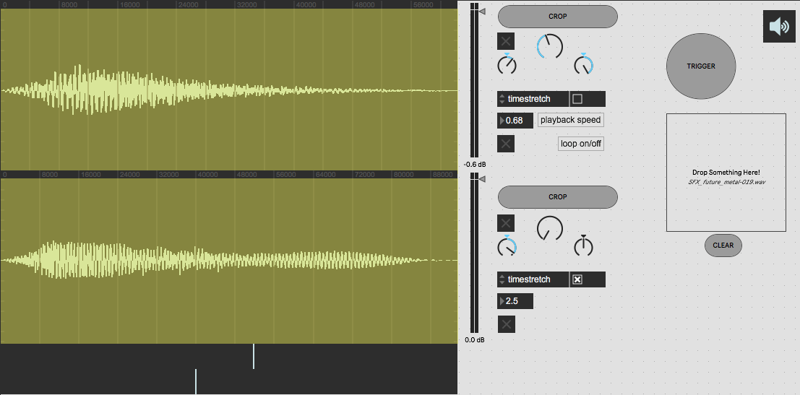
## Happy Accidents Generator (S-Layer)

<pre><code>
----------begin_max5_patcher----------
6709.3oc6cs0iaqbj9Y6eEbGr6Ka7nv9dy8gf8rImDDf.j.mMOYbv.NRblgw
RhBRTisSP7u8suPRQJQJVTrIEGuZ.7LVjTr6p5pqac202+78u6tGS9Zzt679
u79j26d2+78u6clKouv6x976taU3WmuLbm4wtaY7qQyRi9Z5cevd2WC2tNbU
T0a9I1uje+Mai1EsNMLMNY8CailmZaMDgFLy+CdHDcFl8Au.4L0uozYLueI6
atb9h4IKS1l8EzOs+LR.2WHoDDQfYz.8kzukY9EeMSmS2a9oe2u69+m+1u+2
+yeLuurd+p30KiRMjBJ6hwKLOcxi+86IXdQ2NbqhpRi19Pz5vGWFU9arJYg4
y9GdsI6Syeu3ZH7xe6v4oJ1ziOmrtD04OKfF3iNPbFZUvoBelThILb.sFZ01
roeaSj80b2ceP8uhauILc9KwqetLe2WDn4zDjk6iMr8xuycguFs3gvzzswOt
OM5v+aWlXQlbQsTx6Jc+2cWzW0LgcYLf6ReIZUj4QmokTd30vk6Uu+syuy9E
9Wu+CYu4xC8c5Up9hOLOYc51jkO7zyODtL8j2soUSd5zWc4g78qxXnpmFoYp
p+hKXrUd3kIqetlY.77Y.Ud3UpISkDFpbucujrM8z2Tcul7QbbNw89C+w7aE
451IzjVmPyXDsrz.Ng9i+7u8O+weG7Iyre3mLSYnYBMSOPX482lNOPSmYuQl
NqH0Gi1BeNB8byQN+bhZkWeLb8ymWlkoTPnk7wB8eXloAXrVh8BH2UJgmvmi
t6XUEga1DsdQzpMoeSYxS8iGpVdBtNdB9tZoaTiz8YoWrv3nSlAWrbPn2Uea
Sxxu839mdJZ6LTgWLKiWqlNses4gHfY.Hmx.nHCCfGbX7V662EQ+loQOGFu9
6MZtxb2Oga0dENvzgLRgTynBhvKo3rU1DJ.h8kprPVK1STDphAFtdczxhwM+
lX66hUZpVpm0c3+o+2SKSBS0+mkw6RaS3r7jw5XCvse.PS7oJWOZzpVsqptS
s2M1v5tW3W68qQ+64Zrb9Zcup8qiS2k9M6.K0AJoi9hRB5TkVKl+cOBXc2HY
GmllIk.QfHfajGX8RY0WThNOkrc02gFKH0DYhOwzCnkDBsJ1JFLaPaWENFqN
NlndNFukYkmvIKlgcl+iYxWqdvwjLMQa42Xg0oPRYZeWTpV9yzetfAgzjmed
YDbgJd2cHnQ1T75VT+PjlwZruk7o4+1o1FULPu+c3l+QT2Z8yRhRqcOTulP0
fdica1p3zO4UYZw+QL3wbe9PPwTg0xRvPPxplKY6huWKIRpiDYCftxLBEYm0
1SOYafP2udS37O68j2SvGNav8MLPsYmeFquIDSUTrFe55o7rIXkuCdpoue9i
9jJnvcw+CqmV3b6+EAyiOKCPM1ZTlU70zusBiK+z1XsqTs5yEblEmfMxIVCa
VtUoV9ov4VkqtSpQ8Lwq1uBLmU4K7.L+Hi7YA9FtvvD4iR6t545fBdrT5T0c
YTov2L+mS6EUNOY0JkGHmPk+0zvsodaR1Ea7M479SociPmUHp0nClYUA62Tv
Mn5XRMnDwuEWkpkCgL9QJTg.qSRUlhR+KUPX+xz3cKiWbHMGsvGX91AkbsUr
NwH7g3PTttH7Am1JBX.c3Zp1JKllOYy+GSJmEHoRAgI4bLVhYk6Z0o7RYOHd
8yPbaUm4rEgogmW3thKpIaiK+l7AH2mk1WlYLlwu1l+vB4.Z9Ka0SXHinbOM
+AVkVE46J4zACUomP31jZYlQwEHGny6brg30cQytvoNxxrFuynwAwy8ekWGH
NxcNN5qrAQrkzLB1WUBD6XBTZoOJc3nuL8Swdwv0O0U2y0j4GfRs57In+S+h
5Rmju8vIItzgIM3rDIFaMaJrQdUNlq7UjS00yx32tTS7.W.8uEj+ErYbLIH.
GfT+BI0tZHHhRtbQ7mw.mOYLmzEOMPEYEsiKYYKd.Tv1NuScYRaXbIi+j.Wa
APQqcQ+Oyod1mkSb6xUYylgqUeDllr3QvSybadZnXSToXDJeraJj8BbSYpwE
tuQDrRIrYXLo2wgTmtViYzmaFRaJTzWSVteUTKpFkn7PPQkC8pKgfhBjNKDT
hfeHIriW.n4bg9D.JJHXHC.EUsqLgC3LaLD4amC2y3MaR59uDqZ31r6SsIyu
Ox1BmIaKkF83DB0EB2NSQNJX.SCsT5a2cYTGnHG974rA9yMcN8k34edcj8Ui
3fYVCUVlt2Zj2kyx0o9MZwnMuOarlvrS+Y1Edf35DrFtZyxHu+ZzRcC2Y+9y
0EbAoZEICblt.L0vcHTmnKnZTfMvL3RhY+dRD9kytKtKb.J5xieDdXNmUgBw
ZMDYcZ5rAVlFqhWIcaj1PQuWP9yvU0hU1TlWdgwAySwi.OssbRH3B69SEYWc
jAZE9WljroCwIhnDW508AhzJ7PGlE5xGN44zcv.mxKO0nm4QSYaWuabgoSg5
azobQpTXW9FasSYNo5FdUucmBSqXEsFAF+rCeg+.twATVo+NXe0nb2u7uETI
oz9e00T4yaSRdMB79.AQC5nSomrGKAQxRoM6X8hjAuWWQssWW4XywC.aGCxz
OQ8aaytt6kjuj2d90vLYn27a.VNw50BRhtpa.VzHtAXmn690esGFrENF14qE
lucnmgDNvJGXe7zV4vA3i8MBpdaFYB3jWfMNXDOfbrypWkERDwntV5vWoQf5
W5m.jlfQbCAOHqr3tunyDUCyIpyzFi4zU32WX2zZbt0GL7U1oVla2jp9Ry4S
Dw8YC2X3+o28cPpULRRs1AzARpcd3xHEU2vrUdczsSWzt.EcICJ8iPnWvGhM
owA7dQzFanKJs8POwgL8MA3OVdNSPVWwD1j1zll+V8G6BNPRWTLOGkfVk+Pp
ffV11RFW+PC2NQrFdfgbsGmwx4.cXcGyL.RO+g877digf5LVIAoKyWLT+8Eq
Z33s5uA2ePOtnfhdtgY3b1woJ3JoGmibtdbTfC8M0cZt43gWyMiY2zvbQ+H5
tcRCPG1KNuMNoAY6kOyQRgMLG0.fF+nsY7SnT3KbuwON8MnwOlcwrmTF+X2L
90fwO1T03GytE.FFie+J3JM4N1xmPoMyrxJLavnCzdTFNA55Pz3YUEB2Pe.K
kOTngmfYYI1Qdh5oBl2u8i+4+B7YPxguh7z8pnCAyrqbcVEIgdpxXWp10EUi
F5aohKU69LzZ0hSPrajtrTklUDQH81mgqT.y5pSipAWacFiblifB0jvBDwV1
Xpgtud9Ib9Bbl+LzaGGAZJ6jOGs9w8O8.t5Iq+PABnxQwh05g0hA0Niv2oaz
a6VlBQKeN0E7IUMH.IPtciPmsPdYIwtmEg.2TYIPB7PPiT642hNLmEwho.cg
Nc51qgx8KSmB1frq1C2uHNwa09codOF4kte65nEdIq8Tdk6o3Ae2KMw6KIa+
bsS8wW14zr14AzV1Lf03DozdHbptCfIDGKILeaxF3h.NcwnHDqYvL2jI3AQD
H8E0.+KpgvWRVtvSuePiS2uHxK4Iuv0dwqWD8UuclsI58OosDotjWnmUUGb8
b7NO9xrkRSDIHi5k8ZWc1wndObvg6dTupWstLTTMEXtJT3BeiBPCXgD7f.QW
T.5zkzJmPGVEfq1AWjHnyxvRansHZP4J8j+HkMW4aq5Fi.SyXVrgptwzQk.R
z0O0WGRFj0NWOmv2UN.95yAx2rZLmT5Tcfh.Io6NqjUtPxjs6oh.nUXv6sMi
MaaYkiopa.xyVgAoPqvfHIcpUgA0gIvNrYkXYbblu6JwfcVcL6Mk53B6uAzQ
tLdYB73+NMV048B2mlbet798oaiUydg61orgLWS5xVqEvNftfWkUQOCDmvqL
eqnsGmHpmhWF8Zz1cUmXXxUVoKWMGUqB+61hJtrHIQJ9f8RrhKsM503iesp2
6VUeOU0w2u0Jv70hUPLSBb658wURvTdWxLtoEzzGZN6WdwtMyTiV4uf6JY1x
dlAuG46aT6HsdwGnSpdQJeu6wmWlL+y1SUWdFutKYSz530Gqxn31KhdJb+xz
GpeRT06WHbV2MqcNy6t64swKRVq6DUFPzWNu4zEvTaLmkIFySrNbSMeYkvnh
yzvM2oHx86dLbqd7JyxJN+loIIKqdqhu2xnmRyt8l30qOhKllro4atM94WNy
28wD0MWct2s4N6dX+Z6cePu+0ePm90pOW3xkYywq95+ZnJBovzH8YJyPt9E2
z5cwK6TwcubYE50dmWq4NKTh5yi9R7hzWpnZTeG0iGuIWH5thQ4EwOGsKs50
RCedW0qTjs0RWZ+iYSkeHMREUrhJp9.pIIJCT5DTuK6AOJW7GA+LkmZWVgYk
qeNEmUUdpTo4Q7dQM.uTOHGs39BOaZTm4oqPvQeiScxoQ6tbipOg0ZABcT8C
oTJqyMT3X5+e69FoVbCTKqYpsLCp4vWagYjucGNZYNGddgcyM4OyCMyyuQ1B
od1hbn3J5SFk9TtEjUdDGaIjMuDtKYawF9B7rhfglgXK1NL1XyP5kXBev3J1
T6aK+EucjRXCL+HaIQGcgDS7+GRTbirE+5YKEm8XmyWn1ZxLwtYfBF+YOgq1
rS4tTmsxVbT0cNKASMA+xs.YfverYIKCOTMY.aFl5OzrCeR9VbYbYGun7GLY
625p7AY3L3XWXXtMm5zQmg7a.nGoIlhbnYJYYKSN5JXih9rW95N20IODQyrE
7YYKe.NqgYOe2xQm0zYW5IzAVJgQwWGW50g2g65jFr7himKS2YV7bjgw5Z0b
xWkf+a6TcHO8hTarp3krIZanRcp2eLaUo8BWuvyrTk5GxrwtzKQs8l6zKis9
5OEucWZ1EsKi8WhSeozxcqKlSp9f5gCS8hUeuWi15Ucsw066kG+l4hpdr1gH
U+Xl4y4sl5KpdQpupJva8dmXU7xkw6hTWawNymC+bj9g1uSmKCaeP+8Kxnum
MUQZJPecUin6TlAFuMaSdMdglcD58Z7t8gK0KOe7bSNxzD5Wx56uXvANyCp3
Ml7ljyD0amAum1udd92IqmOqLyuxd3PzUgMxkKrk68l0a+.aND78GQwM0Xbp
kCuL4KkF62WHFdXn262nS0j9GjR1PwoeJJZQ9ioWnK0ul+Y8vd3746WoFyB8
pwWf5PqN3baTe41nr0ExteBzwfNZLaKS0xbBW7Z3ZcsXyCUc6lnDoC8zIJTy
HM7I8vRx9msybraPkD8VvSa4DUZjxXQMWegy33nf9xwyqnPCCCeHBUAIF5nZ
sLiwOTEs8zNGiO8hk.xHWhs3RQF8fUsKsa6tY1PT73gzKypwwieS4+MZHYL1
hPAxFXx3688kEM+fmGLp3MUz7zAKjjrZThP7lKXdLaf4I9Phk+vJ3p8Kng0k
yzF56WOyZWx9syy6cYJD77qzKWDsS4YYw5Y+oCr.OniUcsSvA1INsylrcgcu
JfFjNFFXGSGGeS8L7UsmoYsn56X9W0Nlr4N1vLVpS8DrAS4.JpWijRC8BwXK
rK6hvNZn3OA.6Em9bqhWrIIdc5tBzq0jQHT1J7aL3T8SzrxJrc2PY9z.QVAc
XVwP0GnPE8XswZ4HKRPWJJwJe.IyOoKL6Gtx1MnrlmKMLZAYcP87PwcvP6DT
5naWk0kQtQ09EXEz50AbbEpHf0PGL1Cnf6ZFt1nNfVy3TCcM7Pp7EpDORLj8
BndmgkisDDBp6YitxJvLMznqrBLSCM5V.QfE3a1FX1EcYYL9BPJGp+.hTN3R
fXWOAJmlNwPF3WHY8uN4omZqNdvsGOfbj4r6fkBwc.mjH6vIX2Zt8ErTZh4r
YY32Lq90tMQQKZsNmXOrN1BuSVpe6F+g4Z9CJ.MpfIiodMfZBEVZmAPt5XIC
J6nsMcfRFrYR2EWlwIno.Vxvv1Z.DZJAkL3.mBkL4zHcZfjLXmVzsy1QYYD2
XAjL9E5SuD0IX5zEGY3R6goGMUfQFL18vHSNQRmPnHCRLjnHSNEG3LPjo8ZB
HtsJvVfxnlAn6LRY1JRhFuGNsh.9+9w+3e3O7yeDpPS.YJVS.KJLiY.5ioB6
PQS4ZBH9sTMAD.rFACSirmr+LCkDbOgzn.7aeDMBkAnEWU.M5FZFAGMiB7cc
AiGY2vnb7nhkQ94VGtfPLjro.PFQyPI7oANFIINGHATwUSNt5QKvSHTLxsUN
KjOydHrESBLLRHbLBMQrq+7DAAi3xwQdULovuHtSS.P.hdZ8cWRGSzKh7Kvz
0y4ND9FD3oM5MT2vhHX5gbQjaf2Ps9WHnS.ran141hIBtEwcO7y4ScmWntSe
Mev0Wy4WCLK5.5u8FAxh7sGfzfqMhEggfXQLGaviQd6YviildnUD9lAuZM3w
lpF73ASArJx4.HsfaQ0LtbJfTQLWiAg5pGpuqnNfqIQqvnZ.uBRxUCv8b.lh
9S+7OAdIINrpmSokjvx5kuUfnHzaokinUgQfqyrSgKKLaRhVVHS5W3j2Jfk0
ORHkE.XxpXMZcDHYg8m5XjEwDsEkL4fHq++B9Xgph5SA0hQNzVwHGJTmab5Z
DjK2HKMog6X+1Tz7FcYQYWTpd3GpK7NMSE4dtIqq3.1U4g8KSi2sLdwgJPdC
ZjXy3XRP.N.o9ERJLo5JqBzmgIWrpEh9ijqamKAZkCySGB9PCcXBxgqoZpr4
mexrL0dHdU0m0kvjMg5p0Bjp7utzJsHLMrCVfS1FWSw+t4AXBMCDnLivroEJ
uQcJvfQ310bVNgv3Mrb.nPFYDP3MTIpri3XVc7AmBmeT6BfkwG9AGA35N3Jw
sIZlRmN3+lag+MrwCurjO7FF82nxtC9aRhc8gtBX+FkOUg9MqK+L+oFxuQoN
E32xHSxz.22n3tC6aHpsfCeEP8M5aLPeyOvxplHX9FIXB.4a4IUmN9H9FYBr
.JY6k27bscsw6M7E.2aDYIo5QEs2r+tyf8V.Xrda5A0ab6FBDOUP5s2V6HgL
ysb+ACl2h9GKBm2lzKxmglQ8K8S.5Cd1yCHK+2m+TNTdNqCOuz1sAQVcorbe
YBh3cxQBu6xbQicCt6tA2c2f6tavc2M3t6Fb2cCt6tA2c2f6tavc2M3t6Fb2
cCt6tA2c2f6tavcGL31.cCt6tA2c2f6tavc2M3t6Fb2cCt6tA2c2f6tavcm6
g6NzM3tyQ9eeCt6tA2c2f6tavc2M3t6Fb2cCt6tA2ctFfR9gFAW9Q.2altfE
z3ivRSDHnZR.GWSX7JaJixaSWrwaBinfSXbXbJ.SkSWP77GO.ScJ.Cs+fhvu
N.8j6Cb203wBdYT3VvU.a2V..JAILj9c5HypOLPqlr9C5YCq4p2ASLfG30mi
RsKNBzJFqSOrq37yaCot84laNcIaUcoHuNQjr659nIjQRKYxC5O39rnz4x+z
hFUoa1Bx9ji0M1rlg37N.eCfJloKhlmrHJ+LegF0xlWVpzsGNEt+PUtxhWWy
A1nkBE0gQnVKETM7n4rigCMSxKfQl8WvBvmWT2W+hP3riSzPnd3vo.86UpvM
fw+r6FLM+4fvI8THryJ.a29HmQ5MRYfawAWYqHcXdWUyBtkMdrOJYLySc4BW
wI6l7LAWJh6SFxf2VLHsU4jpc4sEJ.PaoOikGh36nfFFi11+z1F0q1V3CgE6
yqus6IciofZbsT.t2xRX.sExERR9vlgfpWTB0SQIIXVp6GOg03GIs6LJGjvD
RLLTNuKr8wfPaZHFMFB2G0EcEW1u5bllViEwgvh6Ya0FgxPNnovRX5fcixIe
.rPrT5f1BGD.ht7cPagjBqQhySWldjyseKA2zNeJQwHUKimtgGqmUSZa5GMv
AlqssEFTa024eHPMER3plh.po5KGDKDPTf4BKRXAe7ZJLHWk4NosHfZKgSZK
Hl1J5QNnsZmtbQHbXNLdnKrsAJTFLqpByiVGf.ypqfyp+j7hObpdabO4Kfza
ycx3Ma7ZKFjH1QTmXNhBY7lRbVS0pimNQJFCxCaDyMsEChVGetyZqVkB8cgV
GDHOOwNIbrhd7Yaq.2PVfh+gxbVa0pXXdFb5YaAYlbQOpesECc0xyW.9p0zc
frcdNCBHfrILHoL.AxWGzQd54pFWJfLe0MAmI.Y4U5j4qfbLFI7GhLbBrwkh
gQbB2EtriobIHuPjNQMIv4M3AgPExtLD2y1R.hPkNKIUsSWNw9sjARXwI9kv
C.wCcx3En.mJzF1SdHnIAbtSnKNXMKjd2VLvzEZTRLKhSFDEIbJHB0MSB.YZ
f6DASNBLc0agEFHkVlbLz+1BzjatSbXhE.lt5+3En.bbxBWYeKvTjz+rziAS
W8e7BVdQXtfGBKMVFYCZuaKJX5p+7PP9NybRPBLLXcTTWmdUnMNpdqNzwnwY
MDgBYTZbVEqxNKKCvZb9vXrm.wiWlSL1CKNP5frluG+ZGxLDin7tPn8rsfs3
ANwcaJcDoKxH1VvDLcyphfFO5h.hGhbgmFvxWIdXThQfk1cmvSwAiFOEAZaC
6p1BzbamrEkQv1VotgtPhwZklvxtPUWqUIw4y9XA.7fHvEQeBZEuDCyxw.po
kCg+gfZ5iRvmi7KFVSKFh3Af0z7gHNHIDOpjtvY.IApTUu2lOPzMYxHceCMG
zRCHjtX2FSgtYi68FzAlOaNH4PB5XsApAELF2EtLAZgNDtH8IbvR48MoqfxW
nQ8TuaIPaSTWv8.kmKmrtMP162rA4.u.Juglrcz24WvxpiKVYJR.TZp+aLUH
yjcy1uDT1ZbxVQCxFhzER8P7SlPczzqVi3wENU.RgA8bacXaYzGwskmSaI2t
5mv1ZyBFgM6qXjblyCdB1liA.YXAND61g17gqxAOcXxTLrUE9bLo7gv.aUFv
BAdk+.RVl+IaF6TAqCdzNhEPTWIbQLvfRsL0EZQ.krWWDaBnL8hkCgPMnsnN
wE5JAQiiVRnFjsZGFAWfwwGnOPG6T4PryJGqCHOh0gw090R.lRvcUC05flib
GpMBxIGtFXJxPsOCvVvQNBqq0s5QXb8Q3a8oXacy3Z8wXZsAOqqCKq0kJl2+
ud++Ga85wKA
-----------end_max5_patcher-----------
</code></pre>

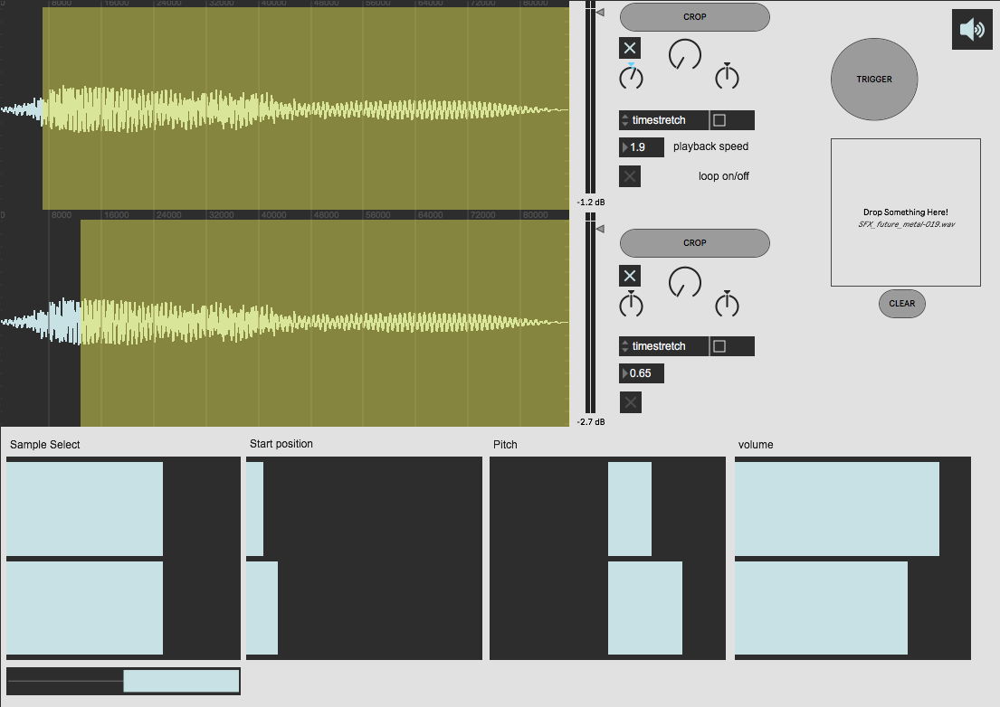
inspired by the S-layer plugin I am adding UI multisliders for sample selections, start position, pitch control and volume per sample, which opens up great possibilities in per sample processing + the layering technique.
- I added a way to record live from soundcard directly into the polybuffer what makes it really fast to record things and start manipulating the samples quickly.
- by pressing the ADD-Buffer button and then pressing record you can keep splitting your recording up by continuing to add more buffers. once done recording hit the RECORD button again.
## Groove enhanced through gen~
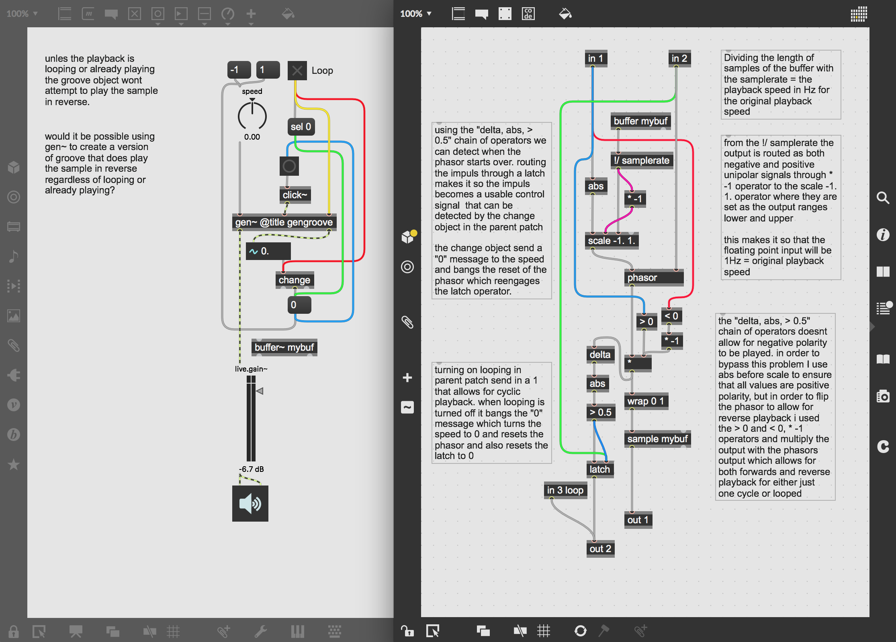

<pre><code>
----------begin_max5_patcher----------
3328.3ocyb0sjahiE95NOEZ8ka43U+Cr0LytaU6E6V09FjLUWXirMIXfBvcm
NSM4YeORBvfM3FbanSpTc2HIP57c9N+HgD+wGdXw5juoxWf96nOgd3g+3CO7
foHcAOTd8CKN3+sMQ94llsXSxgCp3hEKs0Un9Vgo7+WRRZUgwGODFGoJL2Ao
rvv.S6RV+kO5JZzxjiEUMEWVZpewl8gw6dLSsovN3XbuUhkHNeEdIhIz+jhW
gQ+t9N9yO7A8OVNPQ3fJO2em5BQHWEgvcJCzNjAV2xPk3ZKp3kTkU.Vr.86W
Q7nLs3QHLi7YjRJ8NKeejLTgyQdOENJn6.4gSMRkQOd2ksgKZ76pn4JtahVQ
xtcQpgZC4TyTS8y7OnJTYOph8WGoZZIMPYLDLnG.8rTL4U+7lDyX0yv3+BE3
l89w6FrzK6w5i0qVboUJWN.gEanqLrQN4tShs3f8yHISfeFVoGz2FgEFPqUY
+XnRhvqpkaShKxC+tYDSzbJaw4g6Lb2Ucydo8Iwv8E6GoUsaiR7anb08SLXa
XFB+qrPci52T1wxtkFEtPdRs23os0eSK6qCIAlqo2.7EE9jZUPiA0S9Y0i1K
p70rH37q4On5F7SSUP0wVofMNbtCDt..03cs6itvVggu4XrnDZELR50.Zy8e
RE7neA73VerPc5uxKwuR.TiQQGUIaqJtp7lRcTR7tdwwVs7.nOLRbEi6rZCi
009wtqNeeR1I1UdpREzUeTgec8HNFGVjW7RI7Yq2Php90HYT.hUjDOTFCkeG
ifrFnAW2yCwlgijLgwPhB270eLX4mNROqk9YFhT5Ybhv7dSwN5QJ2oh+A5eV
DBiND726xRRdp6.mrND5dBmL.mqCP7KsyoLiqTBCegSTyMoxN2rdaXj5IUVd
XRbCUfweUihaawev+KIlGjasoEH61hD0EkodJ77GK7byfgdALtOlYse+ljex
5U6UOK9XXKyxpgjQ+ns6ySKCFrHHOcEnIpd.KNAHBKQ2wFSQX9kiN3aEf.bf
cQIa9pJnoShEIop3v3zLUNLWK+hxwec0Aps9GiJdr6.osq+rPVsqryniOrXW
VXPRrdPzRanKtp69DhXz0jVBioEw9ocby.6CfkdpLGDxi4q8yzJqROPzpJKR
RhZWU88Eo1VTVcZXb7YnXQRZ+UlEta+Ut20IPkGt1y1TSN3D2V6i.un3Qcjr
1syOJpzPt8i+a9wgG7KTEgVU.EWWo0K797MYIQQsjWaMO0QMA.Oei54vfh8s
RhRWCz7vzJRzhZsbP3NUdQ6xJ72k2tj5.TMJ535R63GKTGRi.oncC.Kjv7BH
B4y4kMrhn0D.NsvCMsqa5UrU4WcgHZ6hrXuB8YPviJ7Wh7WmuD8a.hH97BDL
MivXTxVDPAy7KRxxQAIp73BDnmRdFsMICEq1AlbOoPoIQ9YgEufJRPqgKi7e
QErBoe.YfGBSwujBCHTw9vbTZVBnbNf9uni4Jc2B2D77Tn7M9fuZn0p3bvgC
zZeS+gLYyji7yz8UdXqNcIBBm2pu1FElhzhV5d+7DSQmFzYF+m1A4Z+MeEEp
GEAl1CBOxON.8K.7i9qnORZH85xO.tCBSidwzXHBPJzwOGVruQmkWW99vM6s
8atoiACk85+3Y+r.6i6hghtYJ34AhwWNlWfRhUnMurAvDnhnDXvDzTMFEFq1
jbL1nKINMpoqP58Nw39WfodidKk1kWRZ8rYCewpyRoQ9YUwwu6L2iYfi+c.D
Y.F8eBT.HAM3FPlgLBBIDnKzGQpYRUJCMpFtoF4WApKUimDPTgmOvJR1tEEV
fzYskirVKXv5nb1pkJYcas0ZxtUy2vkJ3b.PaRE0k5GkmzrpHynUeS8pb8Fo
tU5dy5V6JqwIRS9YVUKg5Lip1i4ZcvnbM8LXm3GiBT5TUr5xFfNDzLCvZH6u
rUnL.Jpd9gGROFoUBPg6.i0RUwA+uBNa.0NnmZzr0f93f1KD3vPGcAsARL.h
ufrI7grjL83.7AZGJ.YXs0agcYaP1f6ZVoY70ft943OGeYCMbX+yXcEIMHaZ
F0I5ogVowlFhukjlofTfg6tImqB.W0uWE4XYdx2HyiPba5TgRlQl21rjCF34
u72P49P.aM7nZ5sG7LnIPZbO25QuNHnVQTGbBlwpI9TI23DGqUTkZMoIt2GI
qPv+qqDnwlXfpWLA9zJV+7lClLMSIG7Z8rx5Y4XJbuVhDLPaSiApo9VMqKgl
+mlDFqIh1XXPLVfzR9OeG8qPrlvcgZBccbo1SZ+BNBarbD9sG4wwRRXrltmb
mSRx+N7ovfJOHQfQEPB.CNKeIux1a8wsaAsRc1AMnS+p03rE3p8H.fuNzjQA
ORUvnsRouUM.soUp68N7PqYz2F9AfhYBTunOYF2sLWurp8uTFuxBE2qiKAyt
TnlzgDm8RoldHQ6SYwHY.B2oBMndtlkN205.2YtQieCgGMX3LYfgzw.FkKSt
btAie4F.C4TyLruly4GLfrHGMXvmLv.yVIa9OWoNRlyImqypKjdAFZO.Cax.
Fq2TN1tzvr1u5seR8lRlXzPyVdW7l1L0zdQEdOnBdVMdJWTc4riQslsvXoN7
IKsDJSzgGlx2v3r6gwLiyw5kgMgteKSVC20FI5mxXQL1DCFbF68I5iYUdFMb
PmX3f44zXSzMivALhQzQCGjadJckxqz9ZXme40rvdiVdwSs0fzBGydZp1ksa
rtJcm3LPXXxoslxbBGOm4mhvnQmSlyTmfpMRpX1MWr4ZfN7x5iaGKK4Jysid
UPY4vAFA1rqFbYyMvTtlaWGX5a0glTfoyLwrtYblc9SX7ULl5AdHyal7tuO4
g.HCcrHyjkEBC2DEbeORBYz9bu8E1uz2gzNO2WIGjS6iF8pf2ytivzI556FG
xSNlsoRYTs9vHbKsRfJuHLtdaE8oSYZgFpdXziB2ANJzK.ChLUiBmeJFExgN
JbmPMBYnChKwrMIQ1sY2mfLbIXGlqiDSYTOpfCsckjHcEBNmJnLOgTWjmjgk
tNTlzwU35Af6p1OyCgAlWcWIqmRXqHWDZQZxRi3YRYq8UUaocGm5qZ87M6hl
Fanu2KzTdczzyURH.3I.zxyYoYeboAYAmQ7vbGOJfexaD9JWT.l8cb05Jlc9
.L7oq5F9vSB7MJuCSlOJ1.GEWZQLwvyfGY5EO.cclgjZNJOk6MYticERZdEy
0N2Phv9Bujyqojd4UGjvNkdG4CMpoYzRmU7gLlgF4J9ZbbbjfWaAwgI4hZmM
NXBkJcYXtKk6xJc1LMxBeLxx6dnPd+F9z2YZH40hqH3Bo.h85xwd7F5ZADWg
IwBND3gdYfko1y1.kuJfXRFDrg5wQut8WyhBKc.+qtDFm65gMI9HDRGhizi4
hEROiQlGnLvPSjBGHFu2ri4z6jzRXBpmGS5I8ntXK2QKeTLPmDfTBEB4x7pI
qvHlMSfm8PiX2GNstPTdPRfeIJuZNc3NN5w7Nz3+LL4N1fSOYJ8hyFLudJSh
jNhjWHyoU+Pm5qbBAmgNwWduigxBuoiGYee5JdN4XTfY6vaNFFlSYDxtasMm
0thDzlLkdKN5iJOMZ5sCo8f2Y2Bp5yPhYSM1XSQp26iUGEhL0N+rfHUtYiTV
se70ab9H3IG7h4dgh9GUCtt1Fju9IZDO5uqFk6JYprys83cBfOFGUt+rOc5T
xuBJXZZI7VtgweNQeDcJzG2nBsBoerdUmPnXfPHQdiPH0yhfrp2lzMgfpuG3
uYvmndx302kalDgCw9tdp94MMZMGt5c9gw+n2ivdqZeM4waHGgc8wrSeXBhU
Q0Z2tOrxhAelVW17vsuTOzyKFxAckSwm9FQPZtnIS8QZuIt14YZWd8yztCd.
Gp8q2SC9jsye6mr8dNJz12L1OZ8pwdcuji7DPWyJd0y3N0w9p0cM7AWZmm9a
yCn8B7aQfyClVhCWFHuU5n8EEuUJYmMWPgGwkfcvLpiivqdtfXlmiKihEtLG
LgzJu8KxY2tmZbseYeHdWbAsbYYIl8Fq4p5mU6IMeAUXn.gKaH.AoeffvXv+
8XTOtqYxu54lgYvL13f7Ibnb6zY.7fPEDWJA9wPfEhcyxyJmESqqf9z9KV8U
8378tRHNCrZOujosq0eyANsDYmwEA.2EyvX.HHD6qJfIDLJW.SlV3I4kLSWN
00SRjLttnAnBr6qCliYQLMWcovieSB+YTqdDd9U3eXISJYfsH2iXeOIRNmRw
v7dYBWOhS0xE3oWBeJmwwCh+UdPV4XwkWQreEmzeIfpt5dCLNxA.L7FI4e68
Det5oAor4sGN8nbbrKudodn0UN1E5Px0jVG7p6tAqj0bdmuhOy2TOYduyjAF
l5M0SF+KuVOI7tC8DmOT2cuYYZP8D8dzSzgJSj6gd505o6gZxa.8CAOEwCGb
OSttOWaRhm80uQ2om8Uu4ru3MW90to+uzMm+Utw7EtoqutM5Ly+ve9g+O3xG
ZCA
-----------end_max5_patcher-----------
</code></pre>

- in the original groove~ object in max/MSP you are unable to play reverse unless the playback is looped.
- making my own version of groove~ I wanted it to be possible to play reversed both looped and triggered one time only.
- I also ensured that playback at 1 Hz would be the original playback speed of the sample which can be calculated;
	- Samplerate/(Length of buffer in samples) = original playback speed
### linear playback from a cyclic phasor
- one of the biggest challenges when i implemented the gengroove into the auto-trimmer patch was that the latch trigger for limiting playback to play only once everytime user hits trigger didnt work.
- the beginning of the next cycle could be heard before the playback would stop.
- in order to fix this bug I added a bool to the in 1 operator which would turn any signal thats not a 0 into a 1, chaining this with a == 0 comparator operator gave me a trigger for the latch. this worked perfectly since now the circuit that had to do with one-time playback remained inside the gen~ patcher environment ensuring the sample-acurate timing.
- in order to make it possible to switch between one-time playback and looped playback I added a gate controlled by the in 2 loop binary toogle in the parent patch, providing a simple and clean way for control of playback.
- all of these new opdates to the gengroove still works with playback in reverse, which makes this form of groove unique.
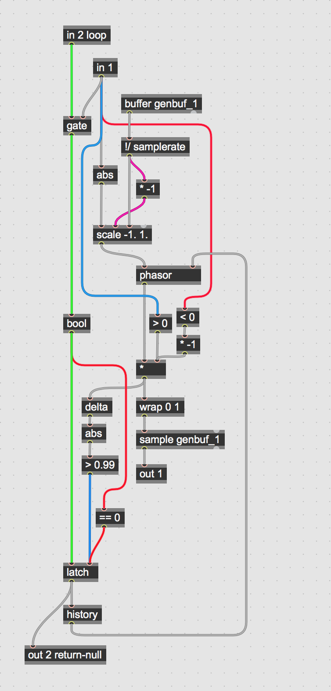

## Implemented the gen~ groove with the auto-trimmer patch

<pre><code>
----------begin_max5_patcher----------
7869.3oc68jsiiibjO2yWAcgcewta479XwZC60Wv.dgMFu9oACJvRhUUzsDo
.IU0caCOe6adQJRIRojhIYU8.2.S2CODyLhLtyHh7e9Mu6tGx+bR4cQ+WQeW
z6d2+7ad26L2Rei24t9c2sK9yq2FWZds6xR9T9C+86du8QUIetxb6s4wadHN
6o5GjcXWZ11jJyOB5tY5Fy6p98efHa8l4GpN8Us2p5K6SrSt6Le7nu2838wU
qeNM6o6KRVWYeCHjHWAdeDQBz+CUn+aDZEH560+l+027M5+58dBl6RJKieJ4
L3D99HXuvHpGXjORXzK3ihHqfLFS.HTJBvEHpBNkqnS.Z2l9RxJCL5F+WhKx
h2kz8geG66qe99hjxjrp3pz7rVyQl.omhPfbkdVAYB8zhPVQafrdIL1tdy57
s4E1uBXEAwITfT.vRDjxeu5VBBFh4HpZ4EJY5kAyHoA3dv7MqQ6iKTvQURw8
IYwOrMo8n1cUA0ZoNOy7o9S4466Chu7h36auPFutRg9d3ooCd8QR.3xUDAGJ
g.ADP3.p38QbtkA.XHIXs9DMTwsAr5YXdVm4Hy70DHLEIIPz687Vsmwkwujr
493pphzGNTkb7+qzQJ5nE6AK8tVO8c2k7YM1uzg4uq54jcIlWckl179Wh2dP
80KVem8Gnn6O461B1F0WdcdVUQ916eLc616eNNaih.5zwnMs6n93pe3wA3o6
i2Vc121.Y4Od9mtMY8gcNJO0aC0Tep+E0PA14k2lm8TO70jZ95Nu7NkHhVT5
cdV4y4EUm+k56yTyZfpAtu43+LOhoHWSLEDPYF1KkjIMmBTyofwKsTJrHHRo
rD4STNUORWPVg4bz0jlrSwRu4JhStIb03EfbqL5CKB4GAr23uRXuGvzxmhqR
9Aes4BOVatJSUnrsWjQ.CUj8xV+AHUzoPtQpgbVLy7CdajImETiLAPZOVTnP
.S2HyAMo1WPEFXPUI2el.0p7mdZahu9BA4WRO.XbvbZV0Ubi.iNGrEbpAfM5
C0+8MA1Cv.uVY4zSdiMX39WkwWRQlFpeuG.Of2C4sjacSYd7XD3K4MCFVxag
bk7TPEB.x.PeqlfOjT3sPYXigNOpTHVl9OrF3nMrvonO8ICo9JvEM5YHg2pU
9G2lG2ZsWONM5u90Eo5W5BnJrnGpBBRiirVJZwTs93OFutC24t7MGUCdKl0t
o0b7LyZ0O76feuurPHjOFVFueeh5wYV.AONLeO3bksYJ97tiQuXaTexcIFdP
pw0Ul7lLBzCyoN2BICp8xN.0PmdxSSMF98g9ebWSnJ2mzXhbulO02m3PVZUY
0WbXz4y9pjreH5WUkpVgiT++OUjm+Rh21aAt6VYY8vxq9oUj.iNZHFbFqo4a
jTbJkgx+8jWRJJ65SjgEn0s6RzrK9uas5WzrznPE1aQatUQxKom9YUe2BEjT
o.iCE10+OyHGW80xJJxNj1YYsdJYVtzzMk6chXtaS49UpEl5OvcsrL0nulaT
bg4b6Ehi3CEEwSayW+wjMsowtKeeRVZ1odJ173MIOFeXa088Krt6yOQNX2G1
qD32c2SEoaxyzShNKF5aWObpkdpwaPZafw7FYw664GqnEUXkAdXoBHOT9Pbg
dsxIEDU+vp77sceTyuaaxiUtGuOMK6DrXU99geXQ5SOege6C4pGt6ReaySJU
x.rO8dEYQ08ZYgceu3sacr0c+7eNNKcmxwopT6R.Bz7PqlfmKWq7LcaG309j
W54IaTj4qS9T5lpm6nnV+D0qmtulH5tlU4MoOkTV08dUwOU18NMx2ZcqCO3X
iuuJY29sJnn6KnXPRKqTBX+To6EqIzZi.NtsFsYqaKiry8ujrxy8Gs8C5SD4
Y11wN4Wbt8cWwFugDQxQlcCn4OBlVxnIlM1+9nQdszeTq1HvnF0zOBEUjnj6
k8grCa2NHdBN.dBNLdBbYDAhuhcJhfaEPJwKMh3W7Kh.iF1AyEMhd+Xzwvyo
nXwwFOnjlMVrAEsjbLXpQ4IFtznlmURxxK9xXwNDwRhcXBCgiMZ4KI1YSx1p
3whaPyFkiDctHFB0Jqktz3lzLkn1sG2HuywOfA3rjKIsCxJ5YwIc9oQe.NZY
NyFWkx7KSzhEVAL7kFa7KGu5HJe1TGwLQexIyEwVZjw+8MfLXyMkgMxGKOxH
9gxQiLHymgJzykvBsZePhEWDxXsxmhmMDC0negXMjSuU0eEHMENyXCDf75HM
sbc71DEFYUDb0fXEx.XEvhx7frwuls33nexOOpLV48dRwkbWdHyamMSTf3db
SDZQR7EWByV8DbrRYvjE01ehQwDVtzhbtAESX7hZ4uM+XVd8RJi4VIkiF4.V
RjCEZcYbwCA09miKyKFKOkXlUUgA1boZwcC5SEw6i.QiV4Metsjw51Lcwca1
pTRuQWOb3w6giNPtCiWPWDu79QfaDRaVTu3QiRgRdLo35Hmghrvrhb5Uyscq
.knWgnuLZzCbQs7iwdczNo2CfQKtgbyg82wyPs.5UBC2wsRbaZ1PaPjYPzOu
e7PY9gh00KM0wSKBzYMZSRYUZVyNq9cG2DnSdwN4HKDSgDJgCH5jLD4RHV08
oH.fgEbtZglCc4HqWqliEV5YJ1OrnCO+UfEDVBQDjT.jrFXAHPDkgSLFgvnx
4DTfiYUA14EyK1Xyg.7rLyzFv60TSGk+SdwloFXVlZ8Lh8O0Dmgz1ktYedZV
kiqR.6Y63PNKlA1DKu8UHWTdfVGMrYwvqK5mAGF8CmG1OfmSMCL.Gl8SxEBF
lh4XnR.Iwv4Y9KEmGPwRhIbh5YyI+WORHF.MCtrnDofJU.BkIIBAEeDVD.Dm
y3XI..Q7NkNfuTjDWZlPL6IZ2qnthDAZyLMJa0hxJ5M9qG54yDEKgJjmTocA
INJJFSzhngXLFHHvyweyLwN2W5C66MOHYrmSB9RKIFGJQA.FGwPBHVo2UBX5
UdEsLGxYRr.n3pnu2DOAAUQPnTJyER9rpXF6KNuFELOq7fQnoatlDHu4wwuE
XB5Y5NyxHn9ZojbFwO9ZSLYFmCDecxfBup1TBkQETgf.jGsLfCnPI.y.TBCd
Rk7tDx670bcJYXZPz7PC5q8hzYUdEbLyhKZZnxnILRRgbLiPaQ..QHl.CTtm
QD34TCf+DyZXAsjBb70+G5bJP16kZ1030UrxBJkBXJk5MqzPJAq30IbIhKnr
qZ3rxEhdxwThM5j1sGp6UXrc6FgGu5MonD9ULbFvwBtxeIE2Bx5DECxT3SBA
oitA0XLkjgUnWNByTHSg7FwlL5wDUsyEXr0KDtr4pEUAr2ADZNsShxGCaIbt
lEhoOKb271a+AOEml8CCVnXlmNTkh0W46P8oRwz0dftHNyR1tN+PV0vkkJ06
x948sqgr2qm9kU2Rs.wIGqcSXati4tvwrn5KWa8rKW4XbfGkN1Yq52V8iQls
5GS25mzE+5.MFo9J34fVoqXNdE8rxyGY2W.NXRE0657c6RxpNClKSphTy.kv
2nzr8Gp7FxGnb4.W.7v8z8AXljFTZU5BBLvEuYiZJDkrae0WhbaI3i4EN.V+
nMo542GRqqIMy1ozHZ.4akdOZbAAXJScWekBhpyFtYsqWQuZ6jQuKjsZ6UxW
otdEFwt8FJS35aLX21WaaPFJeIMXCXecNle8u829g+m+1u+2+6916NoNpA+6
1Iya01IC6GWcKJ7UYuwPiz1We1a5aH1aDwtWIWh89a+c+l+729a+2r1e0vZS
+ZoSQY5+H9ZzEFQFeC14hc9hq1LRIHanOXric0hf2YYzMvirMVyzf.0e7u0j
hO1hPBhI3NYBtFy.ZZcRGu8yE4ai9CYSqty8Qz4Ua4IBPuL4DTFVmlIiUFsW
tPqqO9SpKducuP2pYolFinoljnKsW0nEzq5AFr2.NVGuY8O3uS03icYo.156
5i5PXbBiPmDS9mTzQJmJ28Cd5bksjAAlXhJIsHHsNn1rvt6K6y29E6MWg6E4
Q6C4MPeCjMVdyFtwK7+XXTulcVDajsvXnsyaZ3Ea2bWzAgPSI1D72YsI0ggr
ErK0UqPwZq8DaKcCo+TGDm+C+UYBIgTkYsEB1kWBbRLSCH.obegBQ+XTGdh+
yTuWxArY.hcqotf2DZP1Fip96Lc39.Q5LHzzR7hk7.X72.v4gr8wq+XziQO5
+pIbjspqSDbcIPlyw1VxE0HmlMQx4w0dAw.va59KXMxARQ13Hfm8VJ3.TMp2
Ic2gcdiYQRY3YOZPGPCUBadZ6lJg6p2aDx2QBQHk1UCkHaHqYjYYeH9qUwEU
Q6yKSMFlbYSoPJKi4lMKyJRhJOt8A91YIEvqDz9ArSpOLjMiugHhQEHzIn7V
2MicG1VkVtMcyw.CbE7.0U+30RqncssRgIbNb7c1LmPevJPIBr5+nHHgBn3Q
f3.9X9jNLPahqhud.8zsGvzrm7wFUErbrMR5Wb+xKR6o0.dQ5b2dx3JGmNaD
qSfL5Uk8lG1SiEgQHNyVkUSj69R.YZ1n.xfZwlsr5pgwYwD0eVzH.N7cAtWX
6VDscIto1SjC..hBL.5V.mS3yYHZZj2tUf3i0PTO6t2VnkJspUnSK9D53Zcv
eXhIBn2wd.kDI8LnrdeUTybWLtJqLFQdCfegWZRoqXHrTpKuDIBJzJU4tb+y
ZbAFLztj0G8+wV+93iSe31fKGYDl1ReFV1i9Lbi6DMX5aLTLCp.PMRiQ7OUD
1DqoEkFgOGh+iqx27f2LYf.qcSrRQ7JYDpjHHPS1vyjx5062BNsiFJ9Dgvoc
AkzCBvps+zVl5qxxcP2ip9g1frbOj2Yuju8vtjqHCU.q8JC11ajw3UFTJBlW
Y8hln19G0x4hVMRYrtnAGEVS9iSWx5eIzpVyoOigCj+YCQ5+WRO1YqFz5Aa0
BLIBedvH7g.ERQmewb.SxTpRo5higxAtfUsRuC6H.VP3BAEhm.ePvTO.kyXL
c6OgqCi2f9KIvQjbIAAUOmt9iYI1OMj0u3gOfbIBvHHt7JjM5HdZ6d+vuZkX
z+RciHC7hHx3uZ6LS+0js540nc7nVLxMDUSnPFPwHDal+fa0JAdCHof.lOIE
NWRcpVfSO4etdVad0T+QnbaQSVXSUPrMWj0+i2TER7agzsrl0DAgDFUfolN.
TuGBzWLWL++91+3e3OLbdVGzz5IDohH5qorL1ijU6Zmb1HCE5GHGyTMDdPsU
836uDMOUx0MjTZ2ZEdgwjyKjGlskG+ZUfWycdn8+pVPRJdil.Z+7HjugdRBB
bnq4.mg2RRvOPNG7zq21Ef.0YaTcNG4oBCA81iAr2rYWMyojrdpFNrEaNOmu
miXKNDgdKbn.dOfKjiBwob4.YU0mz91N.qQO4XDOnAkse.Fwr4ZD508HLMr6
wp1HmySMYDbFWaa0m6u940pHvzxD6Qsd8h4LQ855c8Cvyx5ANkAcSEX18UAa
aMzPIaRPommcpWsHuX06m+wST.7Xj8yQ2tyBlL02VQKd3yoOGEq8k6+dd7rV
u9fj1SD5yQEKwAx5UNx5urgWPey++VzMuZGJqpUNs2RM4AXwt3p1LhWkvawq
soFNXal+LO425nDDyCrfXlNAwZq3gZOtYQuoDKGzMCkJfq3fV+gX.Y6V.CcJ
jVn74s4.J6sY57xfr14u5RjNudpk6pAESmxkzInkih+QhVt9I2QRvqnNOz+V
mmujgKtNuADOxlwJ73m4s3xPm0fBrauKPyYdQ5M3ACL3gIlHJUCdDvRreEvq
2DYvLyFVvD7imXliR57ai1+BQd7bmnGfng.327m9c+5ud1NB3OpZ5I94Lr07
Fa84LNBw2DMpD21gAcki2EoE+1+7e4qERwuhnCupEqWybUrwdr5L.wHsFOF5
PfOzg51ng5wYVy0wuALhsuiIVaGeSHFBWr.VndIJOvJ3WO1eNTbtqO2q5Vvz
ndaxcDeMeInQ+G5RDSf8rSwRGvBroYJxYcikIxViU9lgIzYnziv1DyURWpjM
67zJpNwyboUzkx.Ui9xwHehR+QPBnVd7m.t55oncUqDrhDbdZ+ADb3InkHWM
uJmqBFbTU77L.fb2Ioyr.eMBnGAPFzdMKzdBd5fRNcVJaf3CaRyi1cnrJ5gj
npCEYIahxyL8fUEF3Ghpxi9TdwGmTyWEJGemn0tWcBAqUw.byce0gViWWju2
2EWHMnKtNGFH1ndiQyxpa0yp0zmUhkeNe6lHcNulVcXSRT9iQwYQoYaR9r6j
y9COpUJntUTrqM75snKw3Wbs.uDac2y0B2t07VcpQ3ivV5H74LvVZW6aGRuZ
+BSyz8NC2FODPB9iDC9KUiDzdQTMraMtbljpsqzapWznodoDrq0p.ak7VfkY
+pHusa+LDrvga.K09UMU1erbwCvOx0adnhS4+eMf+keS8cAEOLv+zkAfviWC
lKuDbz4STFfu8mPaFaa+alyjABvy9SHx29S3P8dtWu1Snq1fH1s.CB.15Cmv
CWCJbjhgeam0.NcrKoT3j+wl30Ws+ZhrmY10c2baa8jPGQoGfBWQX1aI.vsn
t1yrvEj.iCU+ppT0rNJ9PU9GpY7+PUQpRJl21bOfI23wTuDdz8zZni.1vMwO
uAfX9UIEmF22GS2l7RRQY2UAS7uac6tgDdW7e21PyEMgkUgEr2h1bqhjWRO8
yp9tEp4dkZhenvxh7Y1wi4cCgcQ1gzNgzsdJYV0zrV5HZY+waJ2uRsVU+Atq
k8MtiSZihKgKLDrVMJUEkwSayW+QaUZVGf46x2mjklcJwYyi2j7X7gsU22uz
jtO+Dt1tOrWQDu6tmJR2jmomDcVMz2td3zmt8VWsaCLl2HKdeO+XEcnBsLvC
KU.4gxGhKzKVNSIP0OrJOea2G0761l7Xk6w6SyxNAKVkue3GVj9zyW329Pt5
g6tz217jx6OjYe5855W5d8Vcz88h2t0wd28y+4XkOawUIUo1k.Dn4gVyodtb
cQ91scfW6SdommrQQmuN4SoapdtilDy4.15hz80DQ20rJuI8ojxpt2qJ9oxt
2oITrst0gGb7w2Wkra+VETz8ETbHJ8z5sOpz8hmrMRFDPh6Tm6zy9rixJO4T
OaXYlckapjmEgidVs.uUuHmr4CMF2Mn3xyrpgcxu3bkGCarm0WUqZT8YMSG6
Uu5Y+1jg+exGFDZQC.szgg11Hng8c+JHCJf1W95L+3BaxqBVEAWEAFDsf6Gs
HlKrBDaPDt9WDGuzTH6eNtLunIgd8lqPN2HDaqb5z9i1abxD1rgUr6UAm80E
UBclwGtD3ZwIRLA73X.xGDs.5GszrocAGuPP1yiUApusjdA3dh2suTYtzn0x
1DN0fiRPDa5jS58nVb9QIaiO1jg7VMLAL2nCqMIXxRiNdVYOXdwWFK8Ad9T3
X2lal0GUxhiP9kdHGYHjhXtQJ3d694Kf.1jjOFUuQ5ik4AyGFsftHZ489iZn
1FCtXwQMi1jdLYloRn1pjc4MoW6dGZrLMHwM6OmS1oyeN77ncs61RzEf+ak5
C1V8lyazpDkuOoHVINM5O51M9n3rMQlsoU+RljnTu071GVp29d88eLsnrxcS
612+ozpmasM+5r4RMGTubbUTp528RRQT2bBPmEOO7EyMUyXsAQp4wJy00il5
Gp9Ppepxwac5frKc61zxD081TZtN9iI5W5PoNVF14f922rqFQ1PEog.88UCh
dRYVXh1Wj+Rp4b9MN5kzxCwa0okP5ZSLxz.5mby8mMm.clWTgaLwMoFIpyhi
nGOjst923l4qZi76j3J7wRrguchsZq2rV6a60oP.XAI2zYMmECuM+SsV6OzP
FdboO5WpC0j9OPEsgBS+XRxl5WSuydp+Z8G0K6wqWeXmZMKNpGaA5fswiEaC
mJ1F51bL6gVscehVHjsEoZQNwadINSmkjQvtoYihjNNRGnPMhzfmzKK4Gdxx
4XSLmbc1DZSAsiqTFMp0xKBFFGJmJF20UamID9b3pBjO2d0ZQFKuqJZ8oi1G
exMSA3.WLgMipSu.35N03upYlC3EOZNsxrqe7nupr+FNmHFa2CBhguNVeead
yO6wAiv+pxadxr4Rhq4Rw4e04LOhNy3DfO9xebGb01ELv9xYFC8y6GYUlenX
c8rysYAQfNyxMIkJKKa1O6uqYWVh7coZryAgmyAs2xJqtlmIAyyIgVfwIuXd
wFW878pNyfCOwfyxDi54DiMizNDemDZSCmuYAwyYw4y1coa1mmlUUV2bXrmS
wsL.uyEPQcsSPsWLWPDxSHBIVZxNumZ5MLWKuX4XU06MfeRQPyH0H1Wg5xqQ
MBso9MG5xRBiR6tWQb4inssMXtZt.Ke0SXVEVz0cumZ8rzLybKXtuSs4TEOl
Ll0tEU8p2Ssdvjy7ZGhNFiRVTJd+mZjEGqMBSZguEmXrEewbLFfOvZIZVlYP
ekds3TYdOyfKtCCPusIdNsLG5qAjzAmDtaFzdzw5sIwEd2OpCZI7aMQx1jlw
z.bB26aoEvAKc4f4BKpLDEC1vEyekcyQ7sMuF1Zd0ZELxl2eS7vhcfZKoPMk
RhFEPN1i6QOqSKj8DplImdutaSq5y+7l5TqGNTAGADX6Y6GBzpAiAYs6FHaR
VmuIo4HU02xl7sPaGyU.JtVnnsA8.lqF0TZVOUrwU5jSGWhtZuZZfWsFcLem
7H0sfHSBFrw6hFM78yDn8b7RxlC4CGqDzenSSpw6C0q6lOQ+XTKB3NkWlk.1
l+HWf5MQogayQij5PcX9VcCCtEMdpQJNj4UrdaHycAGi27YKX9NRLnGiDpiE
3mEEFfTd9oqGDhftJ4SL1mxqqVaLXkr2GNUnF21Glg7yAdzxuadjfBeFIb.F
oSVjt.MyTGILvmQhFhQh5wHIQgZjf9LRSkiybtOuLnOhziQhvCwH4i.KyIN5
zGJejXACAP0MroWIraSajfdOTSk7C6kpEnL.PkDuXDElSJXu0iMM9W3Hjy1z
aAaGQkoI38ZBofhPfOYKE5juXiTCQsWZSNckCsTiM77wFNs0ReHXEzECCiAz
4f4P5iZUDu+gFtPCML3PsO1hoOh9hPMuz57s1Vbw2oS7Zk8zTDhw.R8ICu5i
shhfRFkgPRfRtJWeKoTP3DpjKw.IPXZd5glGwOPo6BXGPQJALljRDTHjBnFP
AxARBDSQBBAQz2BP0c.Qo5knH.fM.nfmePgIt.nHXPHSn9arPBYl4s4uDXLG
wDHLFIk3Al7jEXxOOLRdMzZMFjfyH4gp05MXZRCjvGeZD3K4wMAv54jiDaOW
SH1V47oWhrGwvDWbeN4RWi2lpazDmebix3qlLTi8UN0jGIeTzFnwAckwgJmC
tDeBo.ArPfnRLzbnMm6yxn9n6TKIXZiD2WJyo55Em3wHoOOfl9H4C2FiLr9G
HABQXAWowmxLBAb5eXTkxTHlgHLl.1U+yIRonljyB45ZKtJ8r6UtSpMayoD0
YKRBEcjW9fdIaJDJaIjDhxNBNWnwABIGQ..hRMLivPVzBCfHJItJbl5+yGzB
z1koAvlqBsXBNxWVnI6CmOpsor4PVnWCMFvFdEFvoToxTPNUQwyMF.yfLrTc
S.FxwBry.XpxjLhlm.hPCX3EX9gED8BlMJjXJQY+KhiwLHpwrQ0rWwHKT1DH
DBsYvWf9zQRhs0QDg0bQns2m4iyh7PXxEyakI3oNRbeMfcxijOwMgFDrGYhh
PUdwv4H.CfkDj7nuLLDSQPRjLAfbEhRmJBrs3sr0nSmKTdv1VdJhMYKVo93Q
PPBdI0qkxPDfFpO9d.ChsiTuL1oa.u5ZBhQZKfBDLknLSTHDTNhqHgT9DKoX
lSxlf.D.kqx5+0QDMsYN1Wd3IORHuVNBfzBJz2QBM0QxGg5AYef7gqgDBAfD
eHkCgqqDen75VQKgxNJ+FZ3b3pGwmc0.GB6TwRekIMjaQJeen.DEqzmwwrF2
hfXk8iLcTFwJGEth8+tTOAXKAYIg22kDnQKof3NyVffIKWC6s6mSdjP9vahC
yt5fndsglrfLVDu2eCzjGKzzL6BHgR.Pv4LJgRM9BvwDAgCEbk5SID5zexDR
.U41.pwe9ItIPrwrIPSbr7ZAAxmkciERtgc65zP4Z68UXaaOGKEMWEZI7m5D
7P3JRPxPH3HB0UudxBATF.xXBLkKns8jUnL8SKmExBh4dXfO5ePhPnf2Kkrg
HGEj9sQrgvNrFLyUvegYr7KbOvfLV9Zx7jGIuBA8I9tchK1TAjHQZA9JQ7Mb
KDkyQXkh.txSa.9xgqEJQsJlV6AvZmKv1zquN9P5qlLfylHfCUx1YDLV4UHf
vHMFjIjHDDv.pQPA2TeB3ESZqd.lsRBZcAl2Av4g.v8RR.mGDpK+xNAVPFKn
OxR43fMVWGtBh7TuhfHJL4wKyOZifHiyG9uvrZQWPLnWQ4htT4B3r3utWiLU
zeJGglXBL6StRi.AQfBvm0xlTpdhikOATJHPk+d1MwrhU5E1iFjwB3U19FD3
htTllAIdQTfuXHiT5fHJ6yjTl3XHizt2nrLgRjXNlgCgmL9n6kEDrhOxdNab
rUE0IGGW5g3jigqSNBtN+32Z3idqSO1sLG4V8cbaoqmsu4e8M++PSp+6x
-----------end_max5_patcher-----------
</code></pre>

- implemented the gen~ groove thus adding the functionality of playback reverse and also looping and variable speed playback. using simple and effective gen code.
- there is still a slight problem with detecting the absolute end of playback which creates a bit of artifact in the single linear playmode. however this is minor bugs that can be perfected down the line.
	- FIXED
- 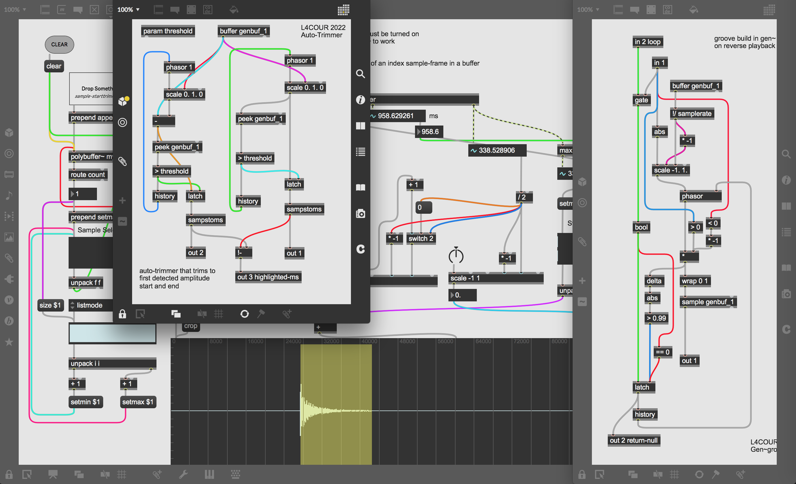
- 
## sources
- [https://cycling74.com/forums/trimming-leading-silence-from-buffer](https://cycling74.com/forums/trimming-leading-silence-from-buffer)